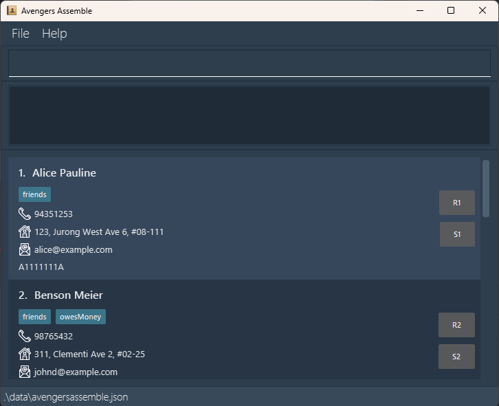

[](https://github.com/AY2324S2-CS2103T-T15-4/tp/actions)

# TaskMasterPro


TaskMasterPro is a desktop application designed to aid managers with managing employee's tasks.

### Features
* Add or remove
  * Employees
  * Tasks
* Assign or Unassign tasks to employees
* List all information
* Mark tasks as completed or not completed
* Save and Load
<!-- Add more if needed -->

# Contents
- [Feature breakdown](#feature-breakdown)
- [How to use](#how-to-use)
- [Credits](#credits)

# Feature Breakdown
```add``` - Adds an employee to TaskMasterPro <br>
```add n/NAME p/PHONE_NUMBER e/EMAIL a/ADDRESS [t/TAGS]```

```delete``` - Deletes an employee from TaskMasterPro <br>
```delete EMPLOYEE_ID```

```listemployees``` - Lists all employee recorded in TaskMasterPro <br>

```task``` - Creates a task and add it to TaskMasterPro <br>
```task TASK_DESCRIPTION```

```deletetask``` - Deletes a task from TaskMasterPro <br>
```deletetask TASK_ID```

```listtasks``` - Lists all tasks recorded in TaskMasterPro <br>

```assigntask``` - Assigns a task to an employee <br>
```assigntask t/TASK_ID  e/EMPLOYEE_ID```

```removetask``` - Removes a task from an employee <br>
```removetask t/ TASK_ID e/EMPLOYEE_ID```

```listassignments``` - Lists all tasks and employees assigned to them <br>

```mark``` - Marks a task as completed <br>
```mark TASK_ID```

```unmark``` - Marks a task as not completed <br>
```unmark TASK_ID```

```save``` - Saves the current state of TaskMasterPro into a save file <br>

<!-- load? -->


# How to use
Down the .jar file from releases <!-- TODO --> and run the command <br>
```java -jar TaskMasterPro.jar```


# Credits
This project is based on the AddressBook-Level3 project created by the [SE-EDU initiative](https://se-education.org).
