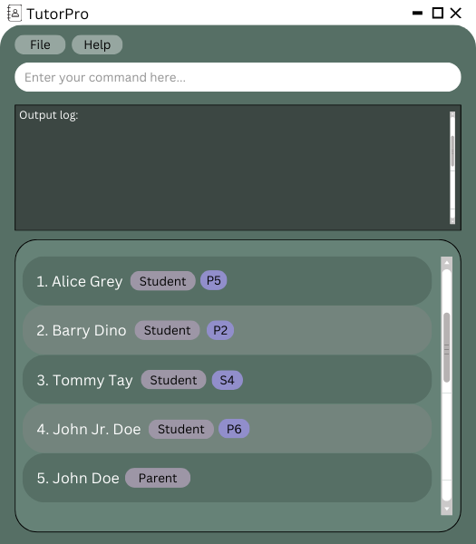

<!--- --->

* This is **a CS2103T project by NUS Computing students**. 
  Example usages:
  * as a starting point of a course project (as opposed to writing everything from scratch)
  * as a case study
* The project simulates an ongoing software project for a desktop application (called _TutorPro_) used by private tutors for managing their students. While it has a GUI, most of the user interactions happen using a CLI (Command Line Interface).
  * It is **written in OOP fashion**. It provides a **reasonably well-written** code base **bigger** (around 6 KLoC) than what students usually write in beginner-level SE modules, without being overwhelmingly big.
  * It comes with a **reasonable level of user and developer documentation**.
* It is named `TutorPro Level 1` (`TP-1` for short) because it was initially created as a part of a series of `TutorPro` projects (`Level 1`, `Level 2`, `Level 3` ...).
* For the detailed documentation of this project, see the **[tutorpro.github.io](https://ay2324s2-cs2103t-f12-3.github.io/tp/)**.
* This project is based on the AddressBook-Level3 project created by the **[SE-EDU initiative](https://se-education.org)**. If you would like to contribute code to this project, see [se-education.org](https://se-education.org#https://se-education.org/#contributing) for more info.
