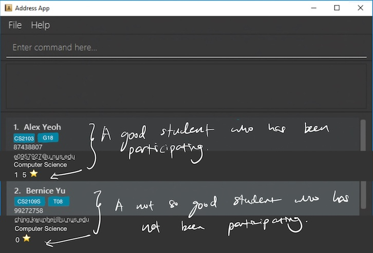

This project is based on the AddressBook-Level3 project created by the [SE-EDU initiative](https://se-education.org).

# BistroBoss
BistroBoss is a desktop application for managing staff and operations in a restaurant.
It streamlines the process of salary distribution, shift scheduling, and manpower allocation for various staff roles.
With the high turnover rate in the F&B industry, particularly among part-time student employees,
the tool also features an archiving function to retain ex-staff records for potential future reemployment.

Example usages:
  * As a bistro manager, I can store the contact and banking details of my employees for easy referral when I want to contact them or transfer their salary.
  * As a bistro manager, I can remove the details of my employees so that I can free up space in my address book.
  * As a bistro manager, I can view the contacts of all my employees so that I can have an overview of all contacts in my address book.
  * As a bistro manager, I can use the application to store the accumulated work hours of my employee for later use of salary calculation.

For the detailed documentation of this project, see the **[BistroBoss Product Website](https://ay2324s2-cs2103t-t17-4.github.io/tp/)**.
