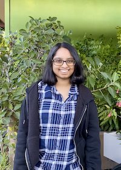
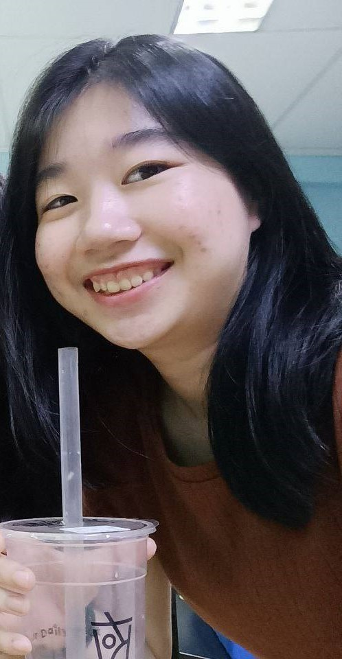
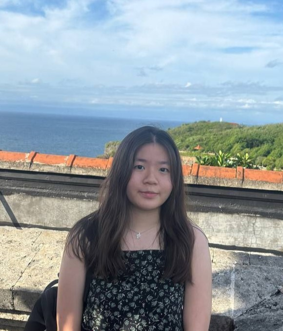

# About Us

We are a team based in the [School of Computing, National University of Singapore](http://www.comp.nus.edu.sg).

You can reach us at the email `seer[at]comp.nus.edu.sg`

## Project team

### Sindhura Rajiv Jain

[[github](https://github.com/sindhurajain)]
[[portfolio](team/johndoe.md)]

* Role: Scheduling and Tracking & Deliverables and Deadlines
* Responsibilities: UI

### Neo Tahnya

[[github](http://github.com/tahnya)]
[[portfolio](team/johndoe.md)]

* Role: Documentation & Code Quality
* Responsibilities: UI

### Yap Xuan Xuan

[[github](http://github.com/yapxuanxuan)] [[portfolio](team/johndoe.md)]

* Role: Team Lead
* Responsibilities: Data

### Fang Ruoqing

[[github](http://github.com/FangRuoqing)]
[[portfolio](team/johndoe.md)]

* Role: Testing
* Responsibilities: Test

### James Doe

[[github](http://github.com/johndoe)]
[[portfolio](team/johndoe.md)]

* Role: Developer
* Responsibilities: UI
