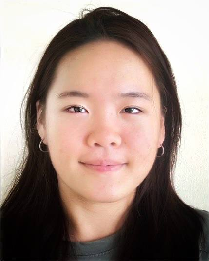
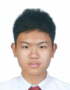
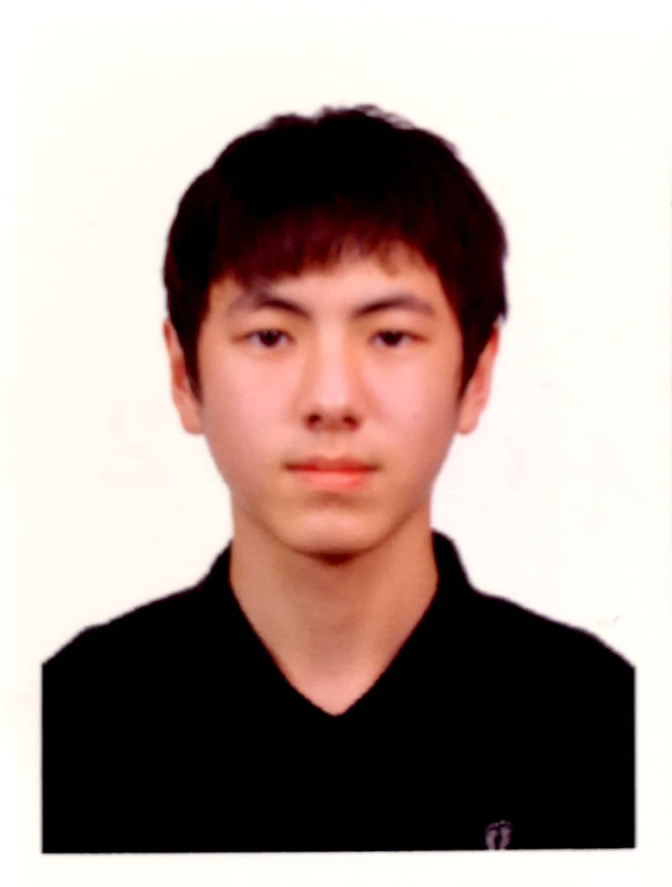

We are a team based in the [School of Computing, National University of Singapore](http://www.comp.nus.edu.sg).

## Project team

### Lee Yi Lin

[[github](https://github.com/yleeyilin)]
[[portfolio](team/yleeyilin.md)]

* Role: Developer
* Responsibilities: Code Quality

### James Sin

[[github](http://github.com/jamessinmaojun)]
[[portfolio](team/jamessinmaojun.md)]

* Role: Developer
* Responsibilities: Documentation

### Leong Jia Yi, Janna

[[github](http://github.com/jannaleong)] [[portfolio](team/jannaleong.md)]

* Role: Team Lead
* Responsibilities: Overall project coordination, deliverables and deadlines

### Joshua Yip Sujun

[[github](http://github.com/joshy837)]
[[portfolio](team/joshy837.md)]

* Role: Developer
* Responsibilities: Testing

### Chng Chia Geng

[[github](http://github.com/chiageng)]
[[portfolio](team/chiageng.md)]

* Role: Developer
* Responsibilities: Integration
