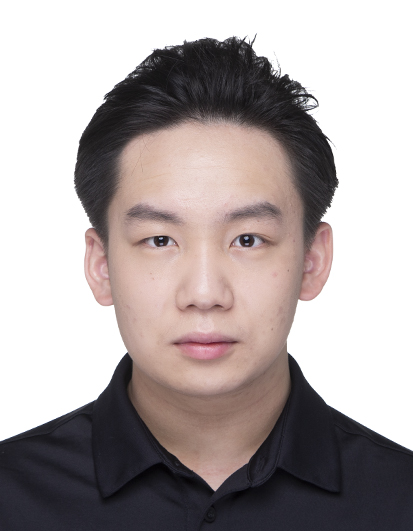
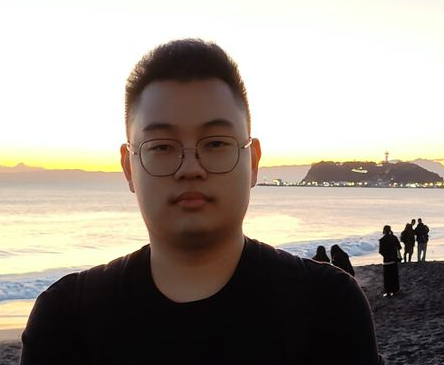

We are a team based in the [School of Computing, National University of Singapore](http://www.comp.nus.edu.sg).

## Project team

### Jeremy Wang

[[github](http://github.com/J-wang-CSMA)]
[[portfolio](team/j-wang-csma.md)]

* Role: Developer, Deliverables and deadlines
* Responsibilities: Data + UI

### XU HANXIAO

[[github](http://github.com/wallacexuhanxiao)]
[[portfolio](team/wallacexuhanxiao.md)]

* Role: Developer
* Responsibilities: Develop

### Ong Zhi Li

[[github](http://github.com/ongzhili)]
[[portfolio](team/ongzhili.md)]

* Role: Developer
* Responsibilities: UI + Logic handling

### Seng Zhen Hong

[[github](http://github.com/IamZhenHong)]
[[portfolio](team/iamzhenhong.md)]

* Role: Developer
* Responsibilities: Develop
