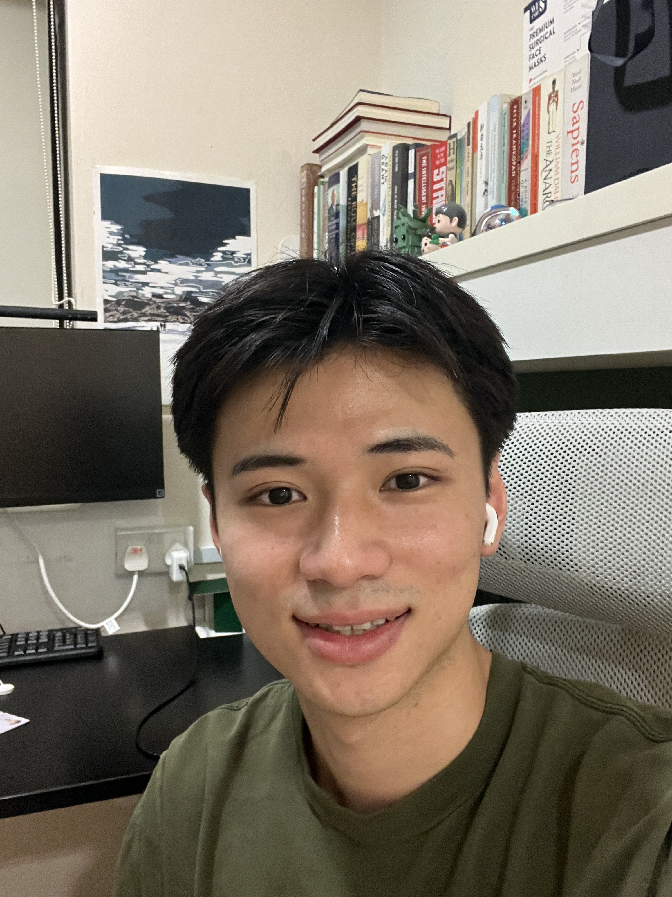
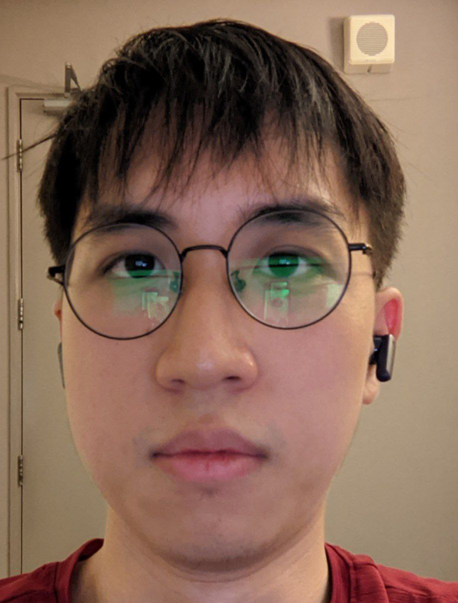
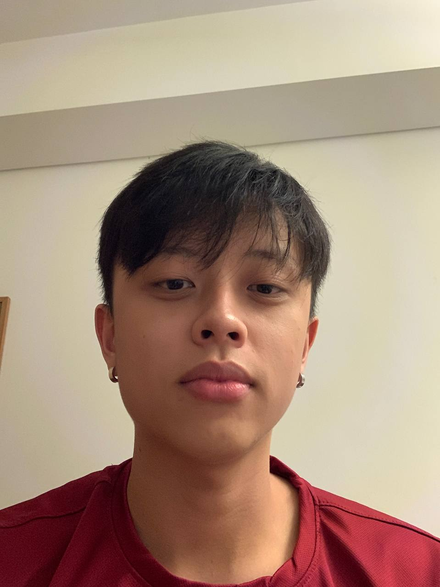

We are a team based in the [School of Computing, National University of Singapore](http://www.comp.nus.edu.sg).

You can reach us at the email `seer[at]comp.nus.edu.sg`

## Project team

### Ho Kai Ting

[[github](https://github.com/kaitinghh)]
[[portfolio](team/kaitinghh.md)]

* Role: Developer
* Responsibilities: 

### Wang Xinrong

[[github](http://github.com/wang-xinrong)]
[[portfolio](team/wangxinrong.md)]

* Role: Developer
* Responsibilities: UI

### Wong Kai Jie

[[github](http://github.com/wongkj12)] [[portfolio](team/wongkj12.md)]

* Role: Developer
* Responsibilities: Data

### Yong Kotaro

[[github](http://github.com/yongkotaro)]

* Role: Developer
* Responsibilities: UI

### Yu Chenbo

[[github](http://github.com/yyccbb)]
[[portfolio](team/yyccbb)]

* Role: Developer
* Responsibilities: Project Structure
