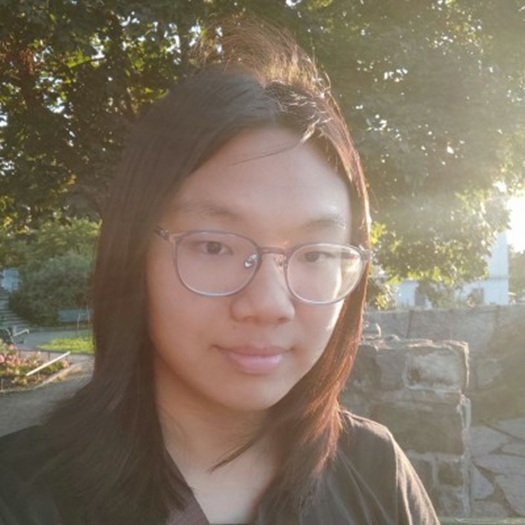

# About Us

We are a team based in the [School of Computing, National University of Singapore](http://www.comp.nus.edu.sg).

You can reach us at the email `seer[at]comp.nus.edu.sg`

## Project team

### Ken Jin

[[github](https://github.com/Fidget-Spinner/)]
[[portfolio](team/fidget-spinner.md)]

* Role: Developer
* Responsibilities: Logic

### Lifu

[[github](https://github.com/LifHoshi)]
[[portfolio](team/lifhoshi.md)]

* Role: Developer
* Responsibilities: UI

### Jules

[[homepage](https://juliapoo.github.io/)]
[[github](http://github.com/JuliaPoo)] 
[[portfolio](team/juliapoo.md)]

* Role: Developer
* Responsibilities: UI

### Jia Jie

[[github](http://github.com/chuahjiajie)]
[[portfolio](team/chuahjiajie.md)]

* Role: Developer
* Responsibilities: Logic

### Jae Geun

[[github](http://github.com/alphajae11)]
[[portfolio](team/alphajae11.md)]

* Role: Developer
* Responsibilities: Logic
