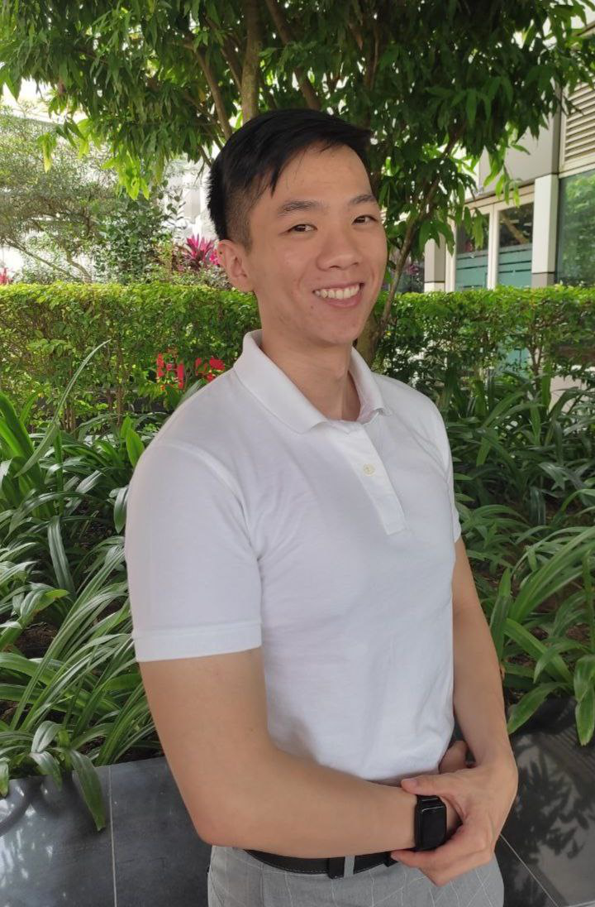
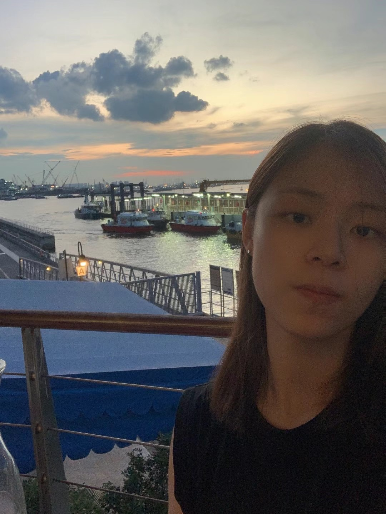
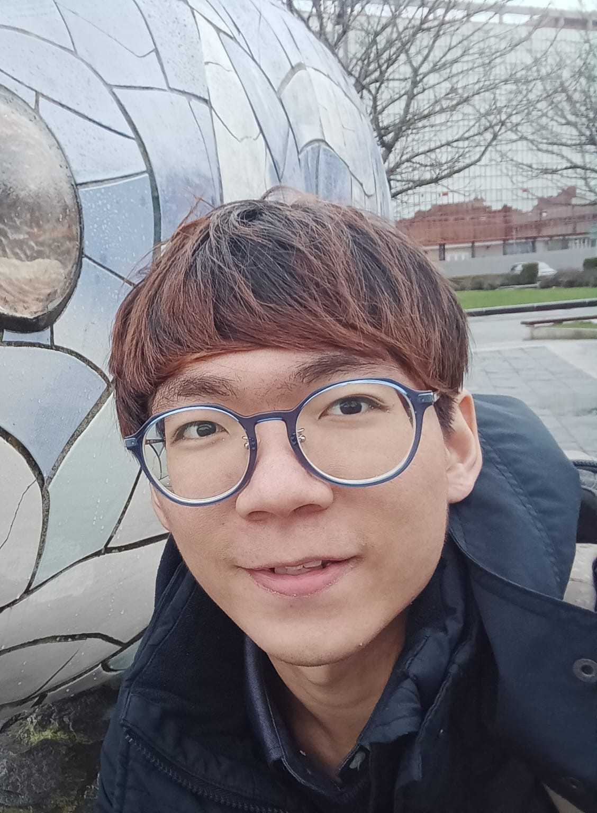
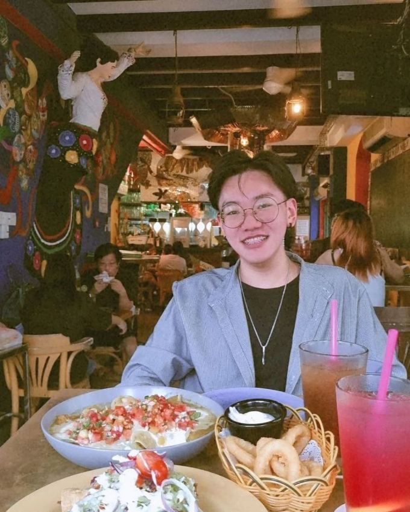
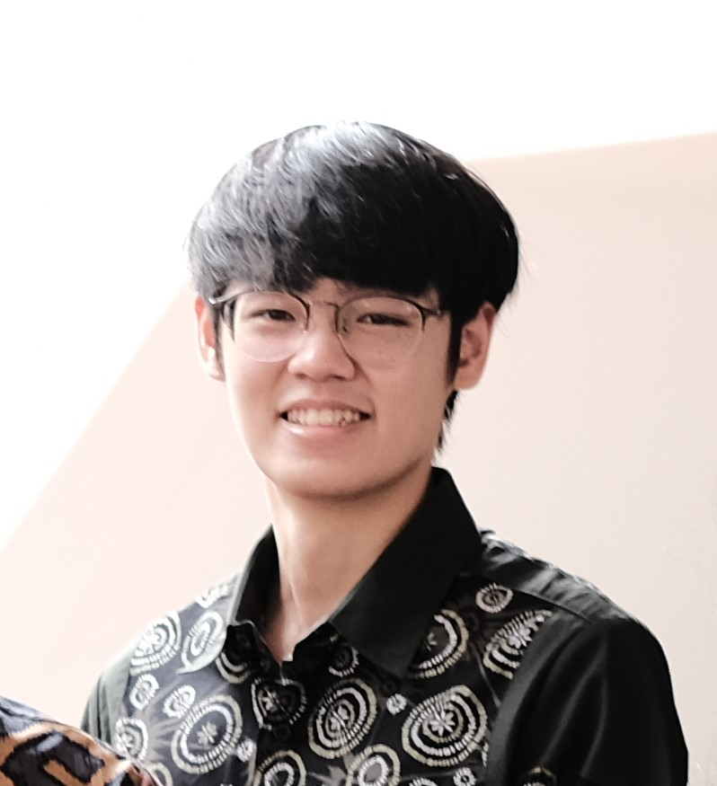

# About Us

We are a team based in the [School of Computing, National University of Singapore](http://www.comp.nus.edu.sg).

## Project team

### Damith C. Rajapakse

[[homepage](http://www.comp.nus.edu.sg/~damithch)]
[[github](https://github.com/damithc)]

* Role: Project Advisor

### Darryl Chan

[[github](http://github.com/darryl-chan)]
[[portfolio](team/darryl-chan.md)]

* Role: Developer
* Responsibilities: Testing

### Shang Feiyang

[[github](http://github.com/fy17ohhh)]
[[portfolio](team/feiyang.md)]

* Role: Developer
* Responsibilities: Team Lead + UI

### Tan Jia Jun

[[github](https://github.com/tanjiajiajun)] [[portfolio](team/jiajun.md)]

* Role: Developer
* Responsibilities: Scheduling and tracking

### Jeremiah Lim Zhi Zhong

[[github](http://github.com/jeremiahlzz)]
[[portfolio](team/jeremiah.md)]

* Role: Developer
* Responsibilities: Integration

### Marcus Lam

[[github](http://github.com/marclamp)]
[[portfolio](team/marcuslam.md)]

* Role: Developer
* Responsibilities: Documentation + Code Quality

### Matthew Elmer Ken

[[github](http://github.com/matthewken19)]
[[portfolio](team/matthewken19.md)]

* Role: Developer
* Responsibilities: Deliverables and deadlines
