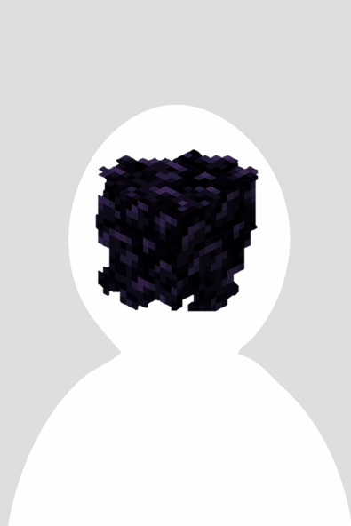
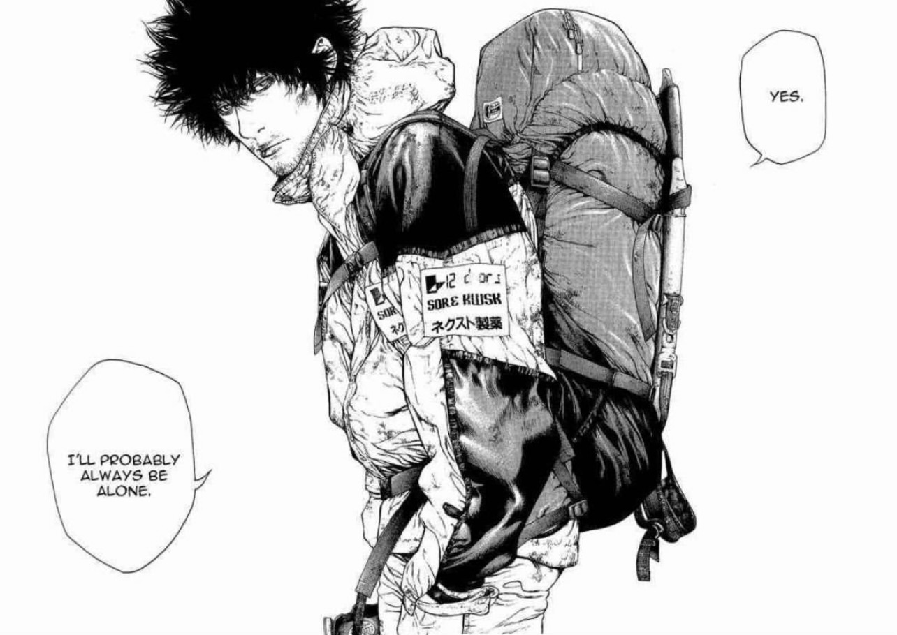

---
<h1 align=center><i>ABOUT US</i></h1>

---

We are a team based in the [School of Computing, National University of Singapore] (http://www.comp.nus.edu.sg). 
You can reach us at the email <code>seer[at]comp.nus.edu.sg</code>

<h2 align=center><i>Project team</I></h2>

|                                                                      Name                                                                       |   Role    | Responsibility                    |
|:-----------------------------------------------------------------------------------------------------------------------------------------------:|:---------:|:----------------------------------|
| <h2>REFLECTIVE OBSIDIAN</h2>  [[github](https://github.com/ReflectiveObsidian)] | Developer | <ul><li>Data</li><li>Logic</li>   |
|                    <h2>Bandov</h2>  [[github](https://github.com/Bandov)]                    | Developer | <ul><li>UI</li><li>Model</li>     |
|                  <h2>Tsenrae</h2>  [[github](https://github.com/Tsenrae)]                   | Developer | <ul><li>Data</li><li>Storage</li> |
|            <h2>DingBao-sys</h2>  [[github](https://github.com/DingBao-sys)]             | Developer | <ul><li>UI</li><li>Model</li>     |
|         <h2>Emberlynn-Loo</h2>  [[github](https://github.com/Emberlynn-Loo)]          | Developer | <ul><li>Data</li><li>Model</li>   |

