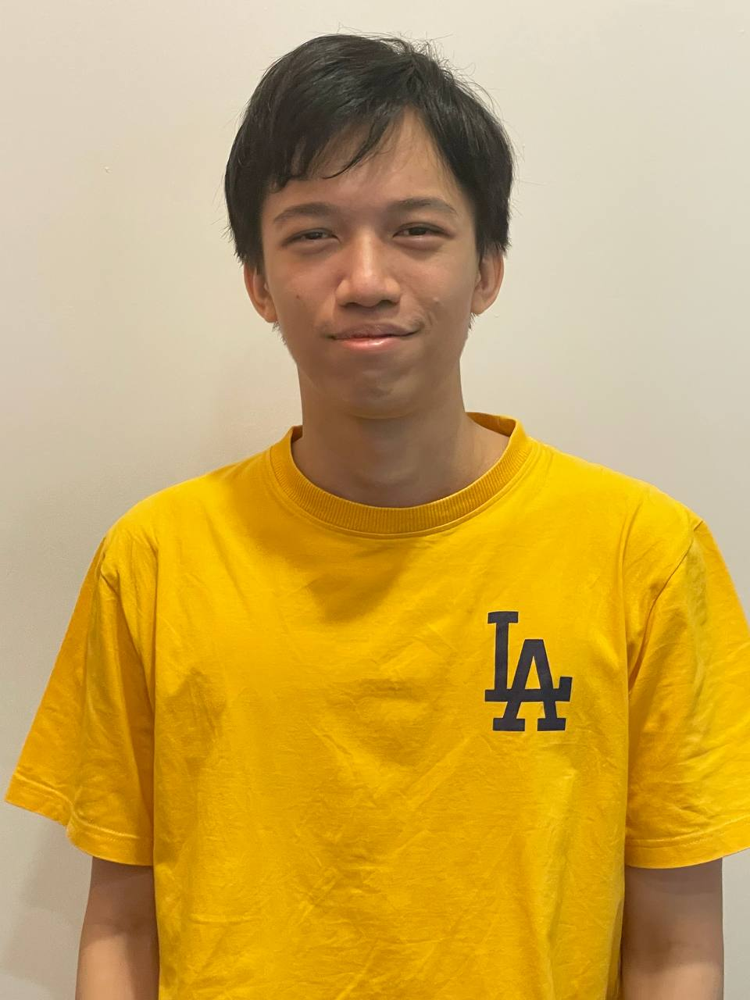
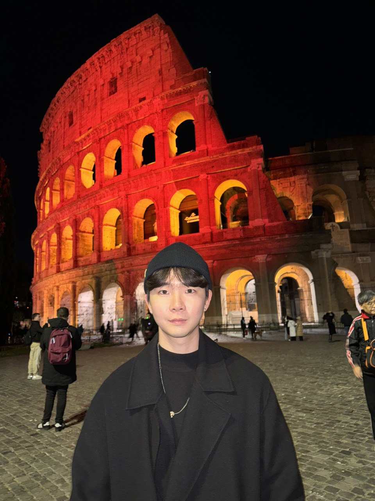
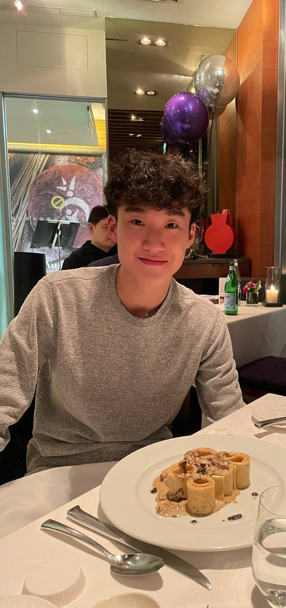
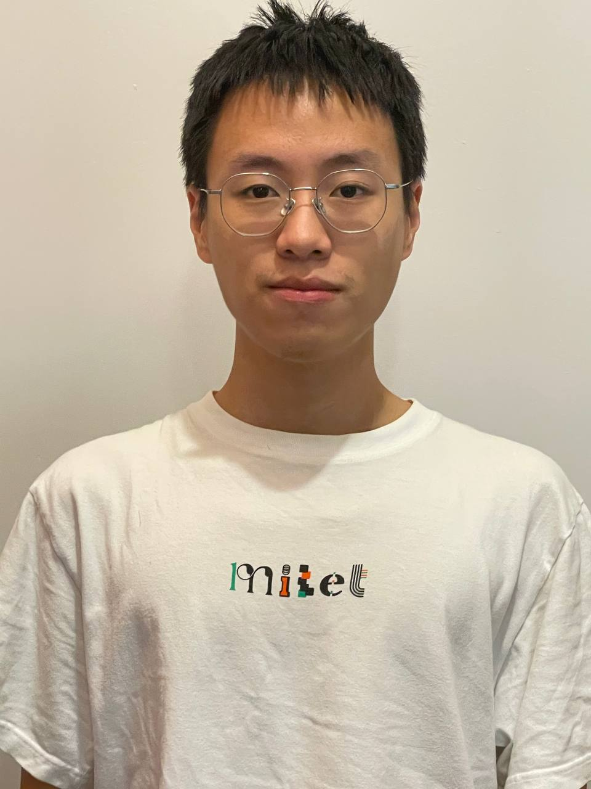
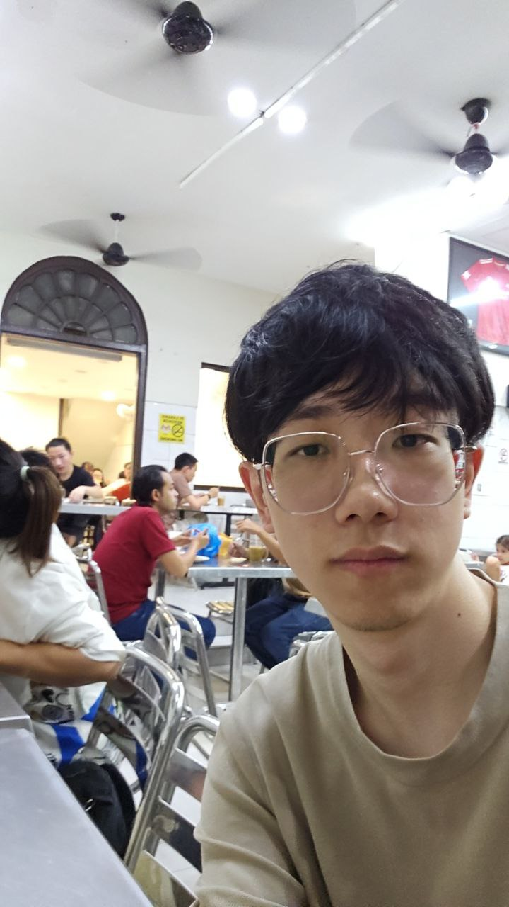

# About Us

We are the developer team of event management app Eventy, based in the [School of Computing, National University of Singapore](http://www.comp.nus.edu.sg).

## Project team

### Nigel Lee

[[github](https://github.com/Apzure)]

* Roles: Team Lead and Scheduling and Tracking, in charge of Model

### Han Taeweon

[[github](https://github.com/taeewonnn)]

* Roles: Documentation, Deliverables and Deadlines, Git Expert

### Max Yang

[[github](https://github.com/myang2020)]

* Roles: Testing, in charge of Logic

### Liu Yifan

[[github](https://github.com/nusliuyifan)]

* Roles: Integration, in charge of Storage

### Yichao Song

[[github](https://github.com/ChocoRagdoll)]

* Roles: Code Quality, in charge of UI

