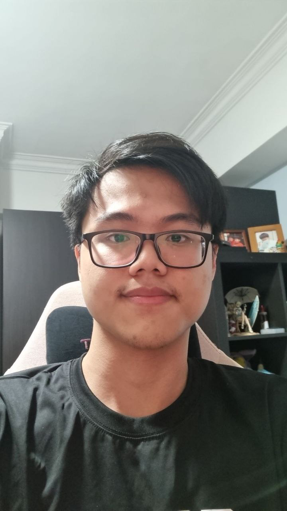
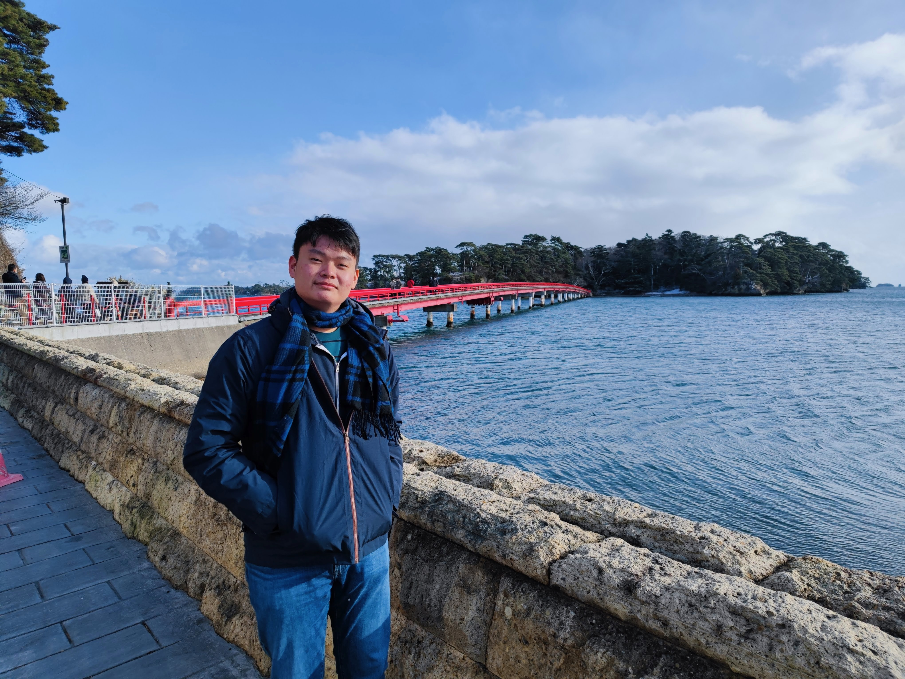
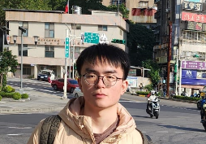
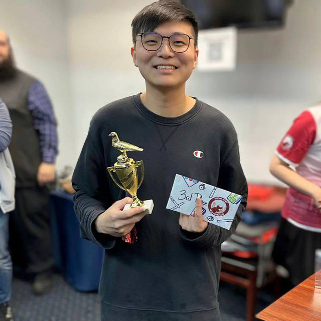

# About Us

We are a team based in the [School of Computing, National University of Singapore](http://www.comp.nus.edu.sg).

You can reach us at the respective emails

## Project team

### John Doe

[[homepage](http://www.comp.nus.edu.sg/~damithch)]
[[github](https://github.com/johndoe)]
[[portfolio](team/johndoe.md)]

* Role: Project Advisor

### Ryan Chiang

[[github](http://github.com/macareonie)]
[[portfolio](team/ryanchiang.md)]
[[email](e0958490@u.nus.edu)]

* Role: Developer
* Responsibilities: UI, Documentation, Coding

### Jiang Bowei

[[github](http://github.com/gingerbreaf)]
[[portfolio](team/jiangbowei.md)]
[[email](boweij@u.nus.edu)]

* Role: Developer
* Responsibilities: Data

### Ong Zhi Kai

[[github](https://github.com/zhikaiong2001)]
[[portfolio](team/zhikaiong2001.md)]
[[email](e0968830@u.nus.edu)]

* Role: Developer
* Responsibilities: Ui, Docs, Coding

### Wesley Weishen Yu

[[github](https://github.com/headcube1)]
[[portfolio](team/wesleyyu.md)]
[[email] (e0959950@u.nus.edu)]

* Role: Developer
* Responsibilities: UI, Docs, Coding
