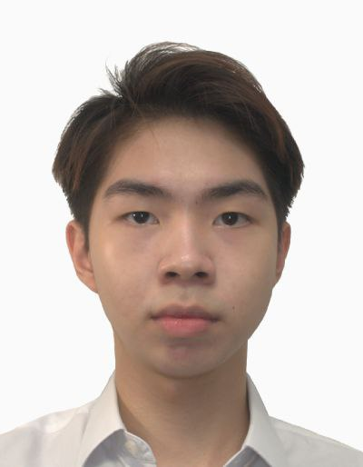
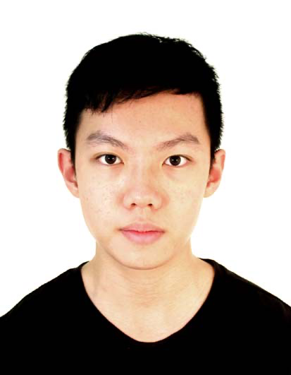
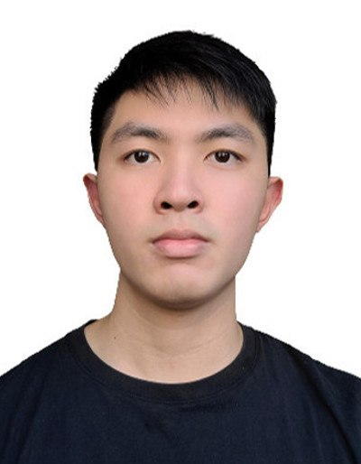
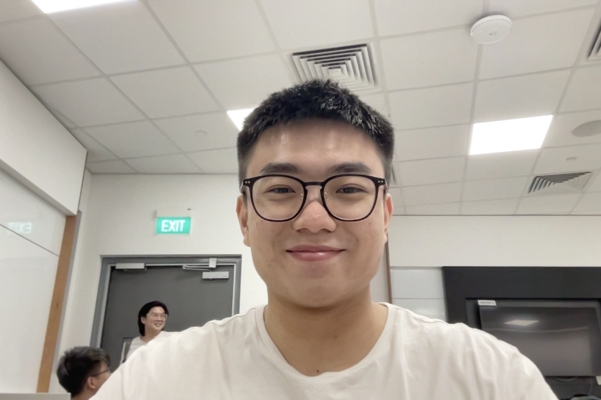

We are a team based in the [School of Computing, National University of Singapore](http://www.comp.nus.edu.sg).

You can reach us at the email `seer[at]comp.nus.edu.sg`

## Project team

### Chua Joon Peng, Gabriel

[[homepage](https://www.linkedin.com/in/gabriel-chua-087543229/)]
[[github](https://github.com/1rbg)]
[[portfolio](team/gabrielchua.md)]

* Role: Developer
* Responsibilities: Documentation + UI

### Teo Hao Wei

[[github](http://github.com/h4ow3i)]
[[portfolio](team/teohaowei.md)]

* Role: Developer
* Responsibilities: Code Quality

### Hue Koh

[[github](http://github.com/huekoh)] 
[[portfolio](team/huekoh.md)]

* Role: Developer
* Responsibilities: Task Scheduling + UI

### Martin Ng Jinn Kai

[[github](http://github.com/martinng01)]
[[portfolio](team/martinng.md)]

* Role: Developer
* Responsibilities: Testing

### Jin Xunze

[[github](http://github.com/jxunze)]
[[portfolio](team/jinxunze.md)]

* Role: Developer
* Responsibilities: Integration
