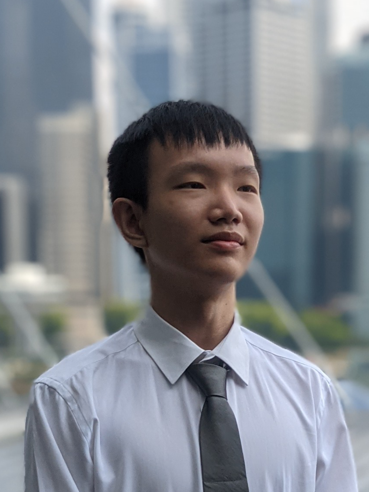
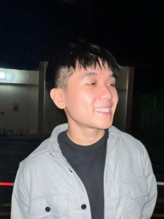
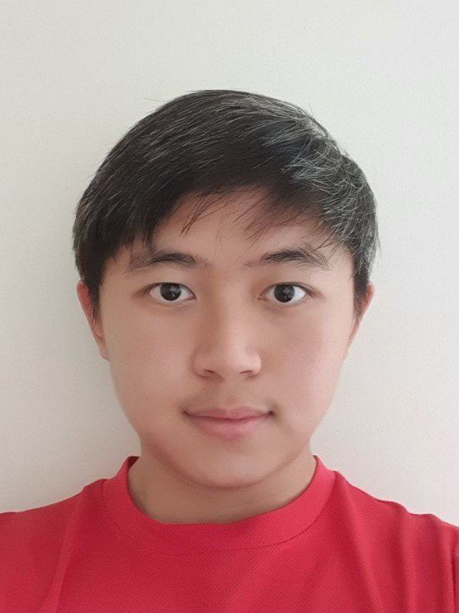

We are a team based in the [School of Computing, National University of Singapore](http://www.comp.nus.edu.sg).

You can reach us at the following emails `simkianseng28@gmail.com`, `bensonang36@gmail.com`, `ho.xu.wen@gmail.com`, `ziyitay1@gmail.com`, `kangyow4@gmail.com`.

## Project Team

### Sim Kian Seng

[[github](https://github.com/SimKianSeng)]
[[portfolio](team/simkianseng)]

- Role: Team Lead/ Developer
- Responsibilities: In charge of project coordination, documentation

### Benson Ang Wei Kiat

[[github](http://github.com/Benson15912)]
[[portfolio](team/benson15912)]

- Role: Developer
- Responsibilities: In charge of components integration

### Ho Xu Wen

[[github](http://github.com/xuwen-ho)]
[[portfolio](team/xuwen-ho)]

- Role: Developer
- Responsibilities: In charge of deliverables and deadlines

### Tay Zi Yi

[[github](http://github.com/tayziyi)]
[[portfolio](team/tayziyi)]

- Role: Developer
- Responsibilities: In charge of coding quality

### Yow Siao Kang

[[github](http://github.com/YowSiaoKang)]
[[portfolio](team/yowsiaokang)]

- Role: Developer
- Responsibilities: In charge of testing
