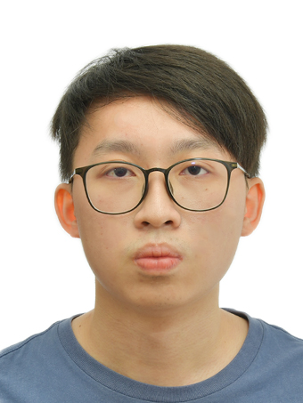
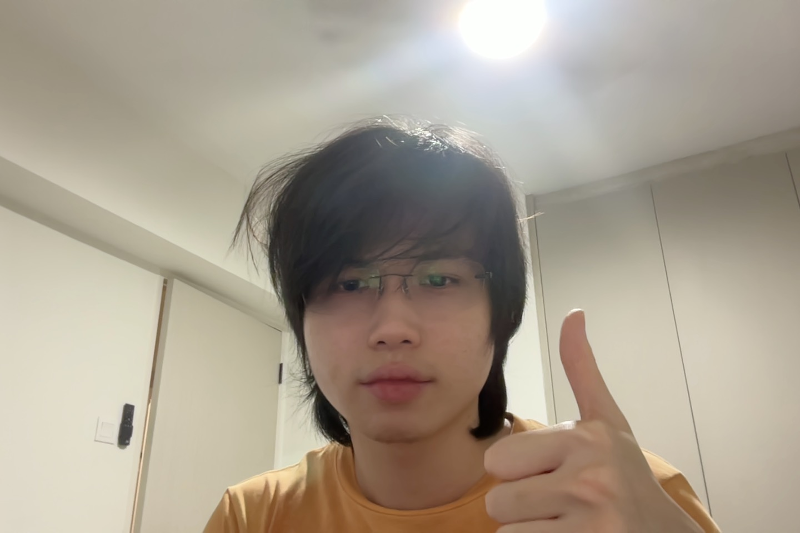
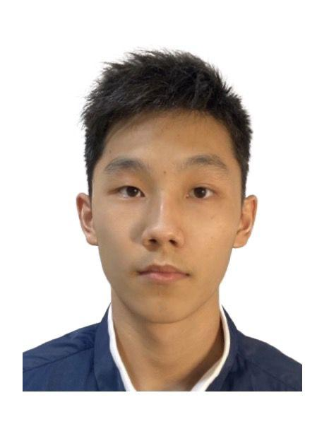
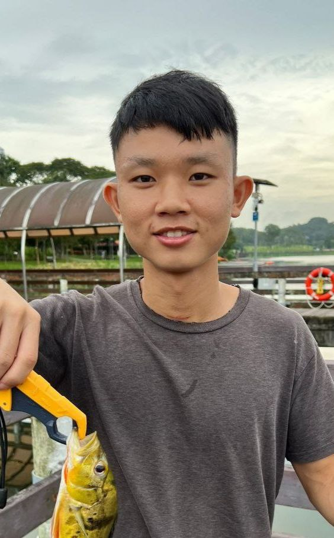

We are a team based in the [School of Computing, National University of Singapore](http://www.comp.nus.edu.sg).

You can reach us at the email `seer[at]comp.nus.edu.sg`

## Project team

### Joseph Chan

[[github](https://github.com/cyqjoseph)]

* Role: DevOps
* Responsibilities: Test implementation and Management,
  Feature Development and Enhancement.

### Wang Minhong

[[github](http://github.com/chrysanthemumt)]

* Role: Developer

### Jerremy Ng

[[github](http://github.com/jerremyng)]

* Role: Developer
* Responsibilities: Code

### Ujjwal Gaurav

[[github](http://github.com/gauravuj)]

* Role: UI/UX & Frontend Developer
* Responsibilities: Enhance product aesthetics, refine UI functionality,
                    ensure seamless frontend-backend integration.

### Low Zheng Hui

[[github](https://github.com/zhenghuil)]

* Role: Developer
