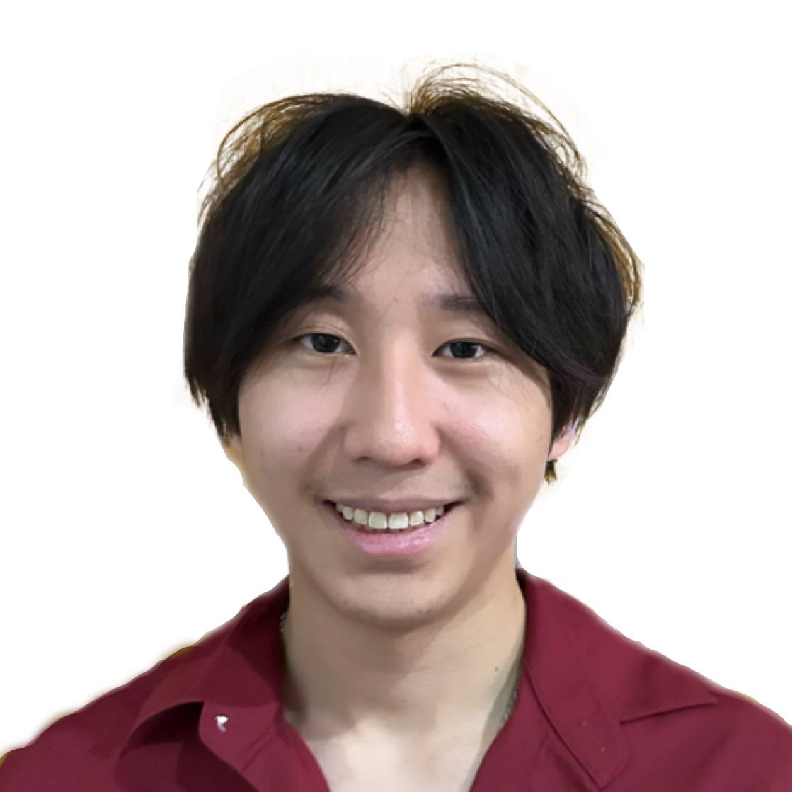
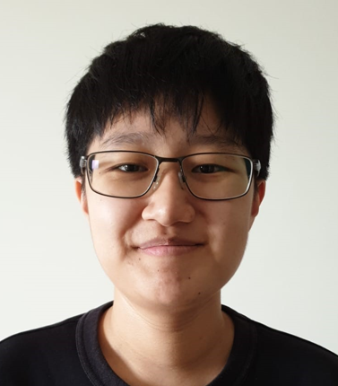
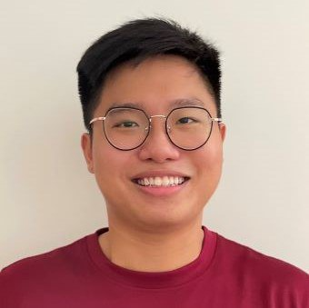
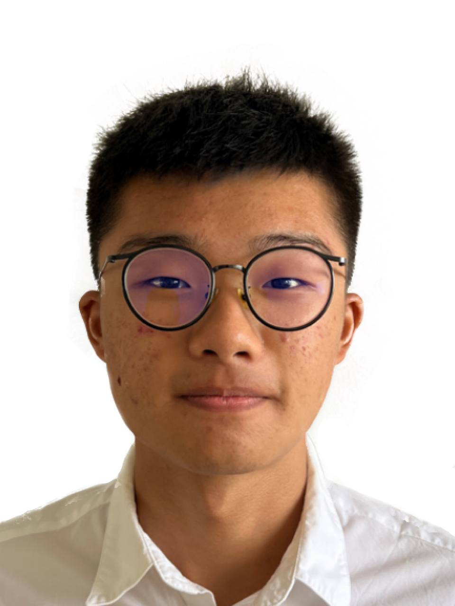
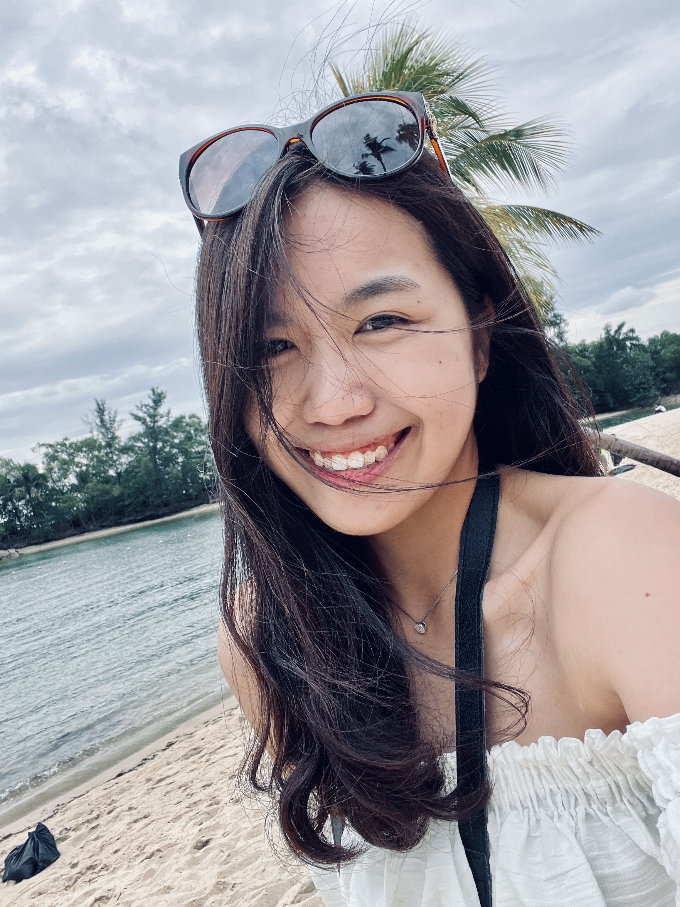

# About Us

We are a team based in the [School of Computing, National University of Singapore](http://www.comp.nus.edu.sg).

You can reach us at the email `seer[at]comp.nus.edu.sg`

## Project team

### Neo Haowei

[[github](http://github.com/NeoHW)]
[[portfolio](https://ay2324s2-cs2103-f09-2.github.io/tp/)]

* Role: Team Lead
* Responsibilities: Overall project coordination, code review

### Sherisse Tan Jing Wen

[[github](http://github.com/SherisseTJW)] [[portfolio](https://ay2324s2-cs2103-f09-2.github.io/tp/)]

* Role: Integration
* Responsibilities: In charge of versioning of the code, maintaining the code repository,
integrating various parts of the software to create a whole.

### Li Guohuang

[[github](http://github.com/guohuang88)]
[[portfolio](https://ay2324s2-cs2103-f09-2.github.io/tp/)]

* Role: Testing
* Responsibilities: Ensure project is tested properly and on time.

### Tan Zhi Wei

[[github](http://github.com/ZhiWei1010)]
[[portfolio](https://ay2324s2-cs2103-f09-2.github.io/tp/)]

* Role: Deliverables and deadlines
* Responsibilities: Ensure project deliverables are done on time and in the right format.

### Choo Weng Yan

[[github](http://github.com/choowengyan)] 
[[portfolio](https://ay2324s2-cs2103-f09-2.github.io/tp/)]

* Role: Scheduling and tracking
* Responsibilities: Ensure that team's task is scheduled properly based on each iteration and milestone, 
optimizing project timeline, updating task status and providing accurate information.
