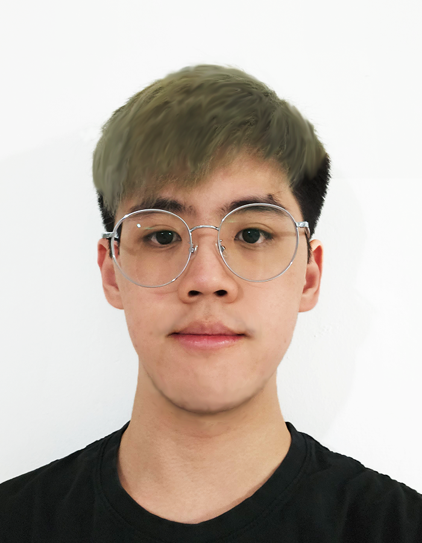

# About Us

We are a team based in the [School of Computing, National University of Singapore](http://www.comp.nus.edu.sg).

You can reach us at the email `seer[at]comp.nus.edu.sg`

## Project team

### Johan Soo

[[github](https://github.com/delishad21)]

* Role: Developer
* Responsibilities: Develop Code

### Ang Leng Khai

[[github](http://github.com/zer0legion)] 

* Role: Developer
* Responsibilities: Develop code

### Loh Sze Han, Danielle

[[github](http://github.com/danielleloh)] [[portfolio](team/johndoe.md)]

* Role: Developer
* Responsibilities: Develop code

### Pughal Raj

[[github](http://github.com/johndoe)]
[[portfolio](team/johndoe.md)]

* Role:
* Responsibilities:

### Castillo James

[[github](http://github.com/jayllo-c)]

* Role: Developer
* Responsibilities: Develop Code
