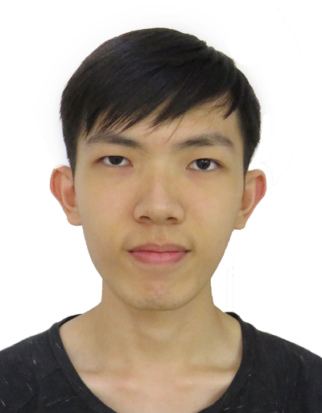
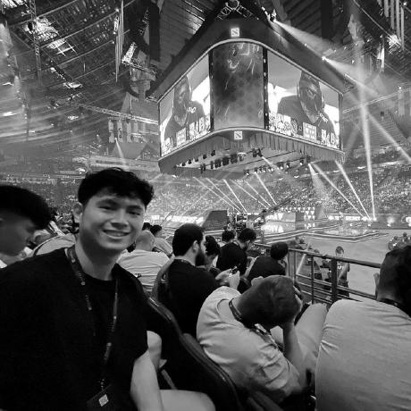
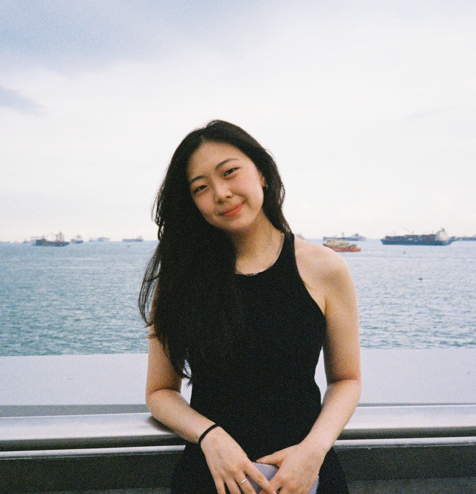
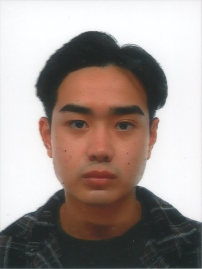
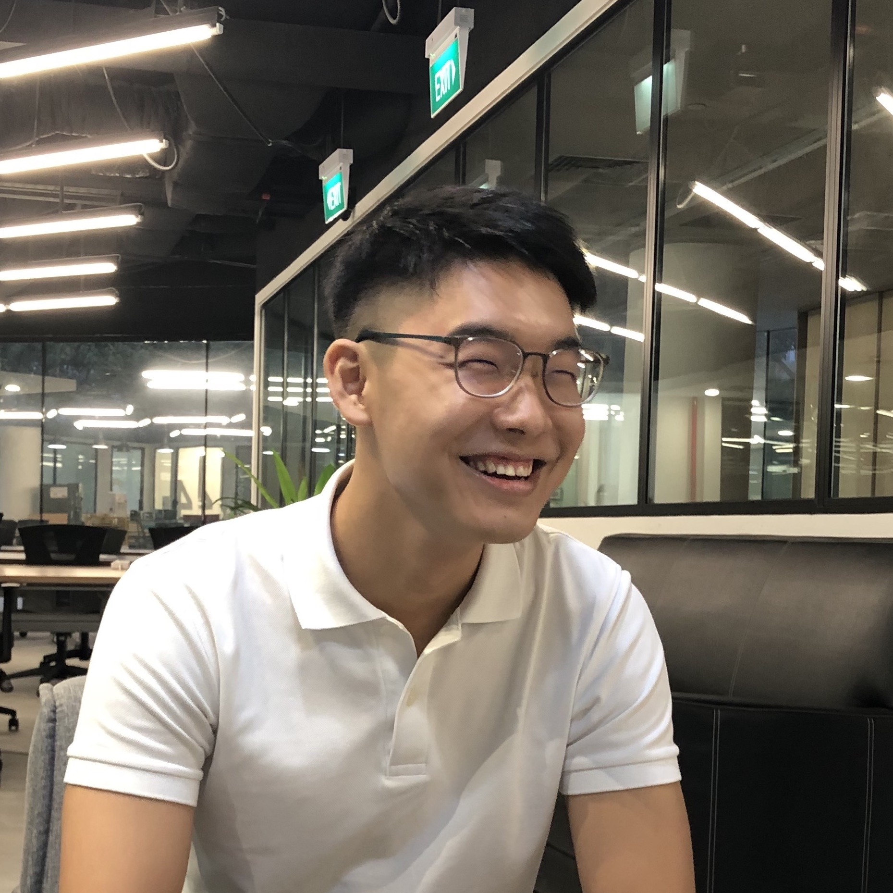

We are a team based in the [School of Computing, National University of Singapore](http://www.comp.nus.edu.sg).

You can reach us at the email `seer[at]comp.nus.edu.sg`

## Project team

### Rayson Chia

[[github](http://github.com/raysonchia)]
[[portfolio](team/raysonchia.md)]

* Role: Developer
* Responsibilities: Developer

### Rick Koh

[[github](http://github.com/rickkoh)]
[[portfolio](team/rickkoh.md)]

* Role: QA, Developer
* Responsibilities: Developer

### Aum Sebin

[[github](http://github.com/sebin0817)]
[[portfolio](team/sebin.md)]

### Jm San Diego ⚡️

[[github](http://github.com/jmsandiegoo)]
[[portfolio](team/johndoe.md)]

* Role: Developer
* Responsibilities: Developer

### Joe Kawai

[[github](https://github.com/joenus)]
[[portfolio](team/joe.md)]

* Role: Team Lead, Developer
* Responsibilities: Developer
