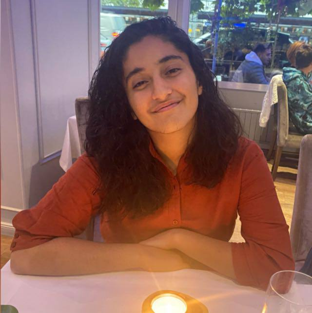
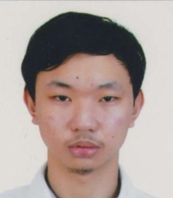
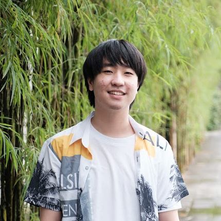

We are a team based in the [School of Computing, National University of Singapore](http://www.comp.nus.edu.sg).

You can reach us at the email `seer[at]comp.nus.edu.sg`

## Project team

### Lin Shuang Shuang

[[github](http://github.com/johndoe)]

- Role: Team Lead
- Responsibilities: UI

### Ananya Shahi

[[github](http://github.com/ananya21)]

- Role: Developer
- Responsibilities: Datagit fetch origin

### Thitipat Chaiyakul

[[github](http://github.com/ThitipatC)]

- Role: Developer
- Responsibilities: Dev Ops + Threading

### Pawirunsiri Thanakorn (Modem)

[[github](http://github.com/modembcc)]

<!-- [[portfolio](team/johndoe.md)] -->

- Role: Developer
- Responsibilities: UI
