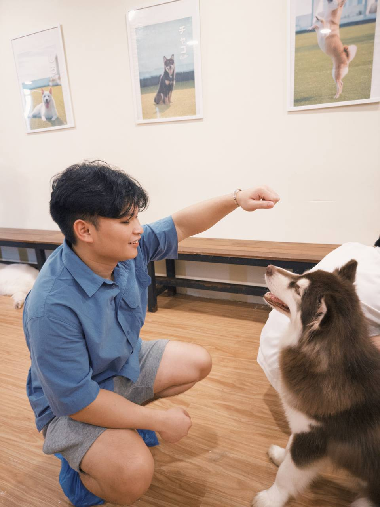
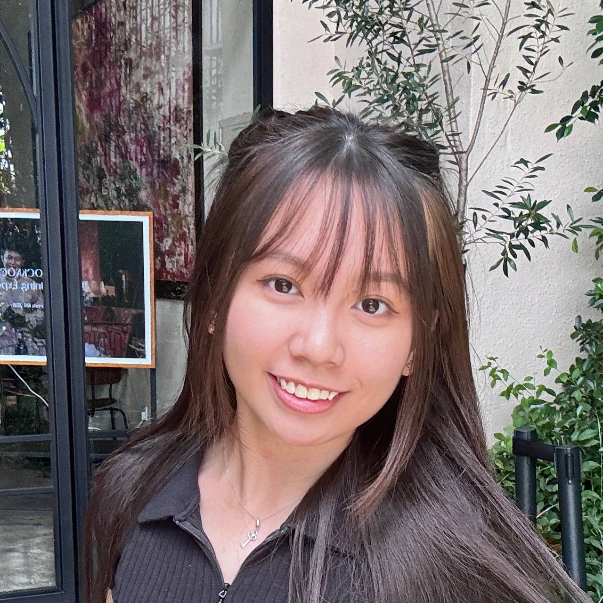

# About Us

We are a team based in the [School of Computing, National University of Singapore](http://www.comp.nus.edu.sg).

## Project team

### Yap Ho Wen

[[github](https://github.com/howen02)]
[[portfolio](team/johndoe.md)]

* Role: Team Lead
* Responsibilities: Git expert, Code Quality, Testing

### Yeo Zi Yi

[[github](http://github.com/ziyi22)]
[[portfolio](team/johndoe.md)]

* Role: Developer
* Responsibilities: Code Quality, Deliverables and deadlines, UI

### Tsui Yi Wern

[[github](http://github.com/yiwern5)] [[portfolio](team/johndoe.md)]

* Role: Developer
* Responsibilities: Scheduling and tracking, Deliverables and deadlines, UI

### Yong Li An

[[github](http://github.com/wolffe88)]
[[portfolio](team/johndoe.md)]

* Role: Developer
* Responsibilities: Task Management, Deliverables and deadlines, UI

### Khoo Kiat Lun

[[github](http://github.com/KiatLun)]
[[portfolio](team/johndoe.md)]

* Role: Developer
* Responsibilities: Documentation, Deliverables and deadlines, UI
