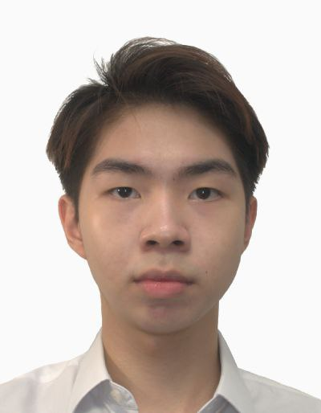

We are a team based in the [School of Computing, National University of Singapore](http://www.comp.nus.edu.sg).

You can reach us at the email `seer[at]comp.nus.edu.sg`

## Project team

### Chua Joon Peng, Gabriel

[[homepage](https://www.linkedin.com/in/gabriel-chua-087543229/)]
[[github](https://github.com/1rbg)]
[[portfolio](team/gabrielchua.md)]

* Role: Developer
* Responsibilities: Documentation + UI

### Jane Doe

[[github](http://github.com/johndoe)]
[[portfolio](team/johndoe.md)]

* Role: Team Lead
* Responsibilities: UI

### Hue Koh

[[github](http://github.com/huekoh)] 
[[portfolio](team/huekoh.md)]

* Role: Developer
* Responsibilities: Task Scheduling + UI

### Jean Doe

[[github](http://github.com/johndoe)]
[[portfolio](team/johndoe.md)]

* Role: Developer
* Responsibilities: Dev Ops + Threading

### James Doe

[[github](http://github.com/johndoe)]
[[portfolio](team/johndoe.md)]

* Role: Developer
* Responsibilities: UI
