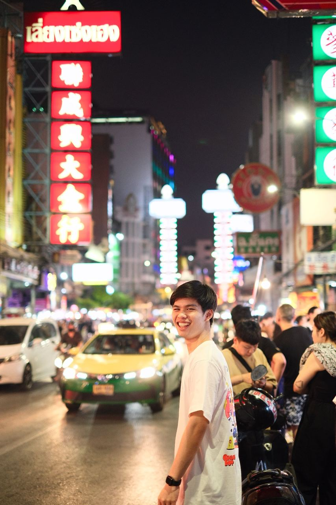
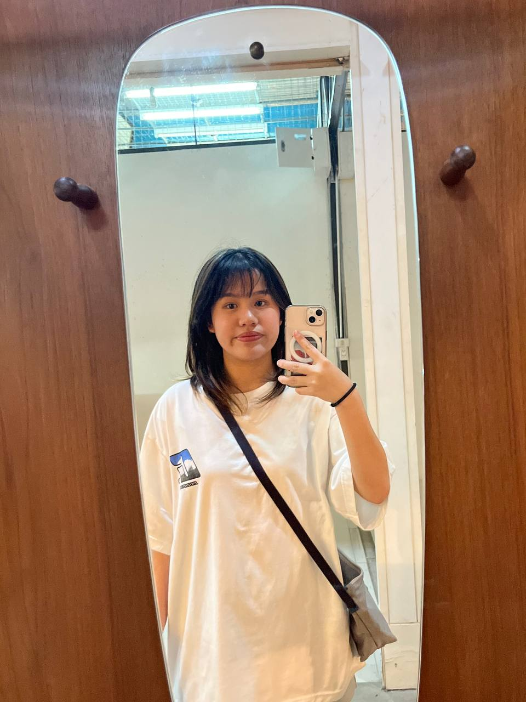
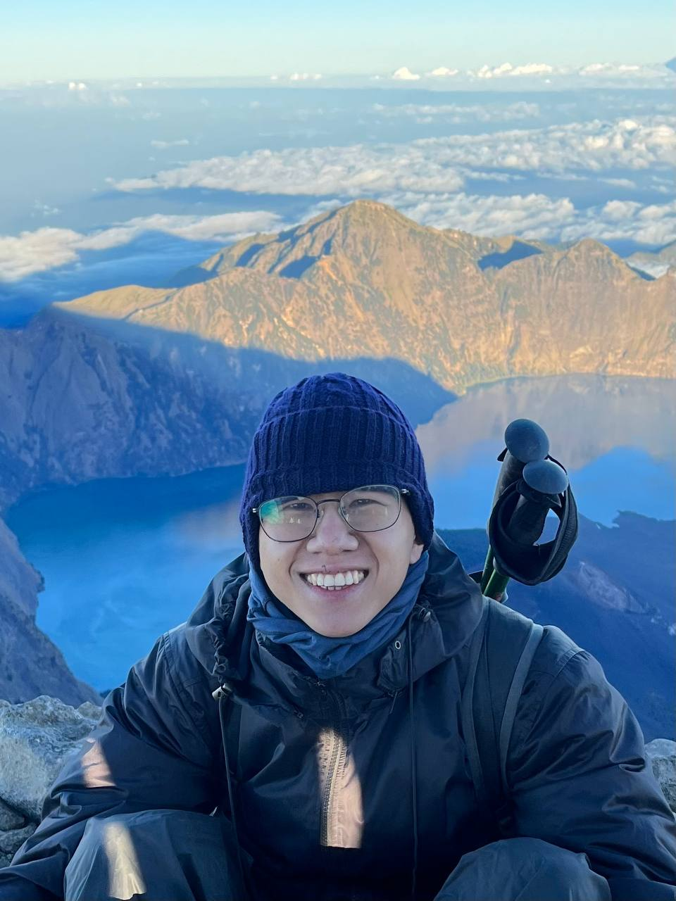
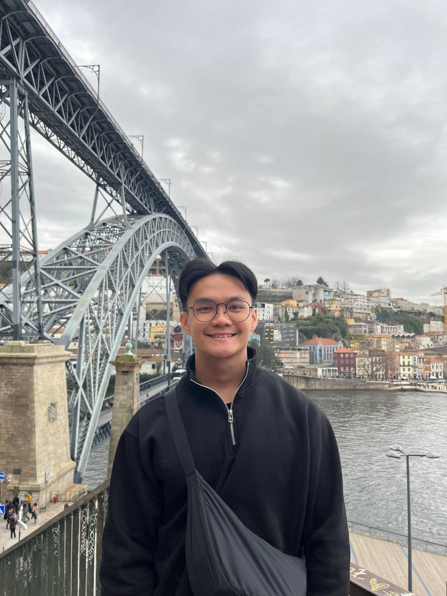
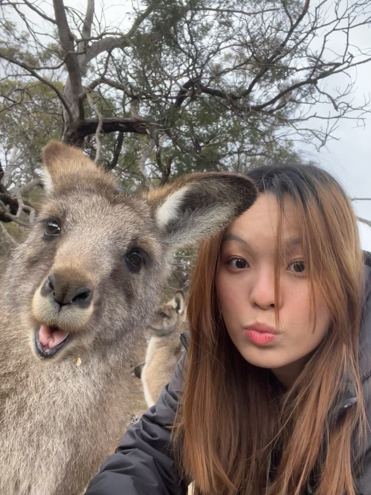

# About Us

We are a team based in the [School of Computing, National University of Singapore](http://www.comp.nus.edu.sg).

You can reach us at the email `seer[at]comp.nus.edu.sg`

## Project team

### Puri Virakarin

[[github](https://github.com/purivirakarin)]
[[portfolio](team/purivirakarin.md)]

* Role: Developer
* Responsibilities:

### Rungrawin Chowiwattana

[[github](http://github.com/nuyer)]
[[portfolio](team/nuyer.md)]

* Role: Developer
* Responsibilities:

### Sia Zhong Qing

[[github](http://github.com/starsia)]
[[portfolio](team/starsia.md)]

* Role: Team Lead
* Responsibilities:

### Shaun Lee Xuan Wei

[[github](http://github.com/shaunlxw)]
[[portfolio](team/shaunlxw.md)]

* Role: Developer
* Responsibilities:

### Tan Jie Ling

[[github](http://github.com/tanjieling0)]
[[portfolio](team/tanjieling0.md)]

* Role: Developer
* Responsibilities: UI
