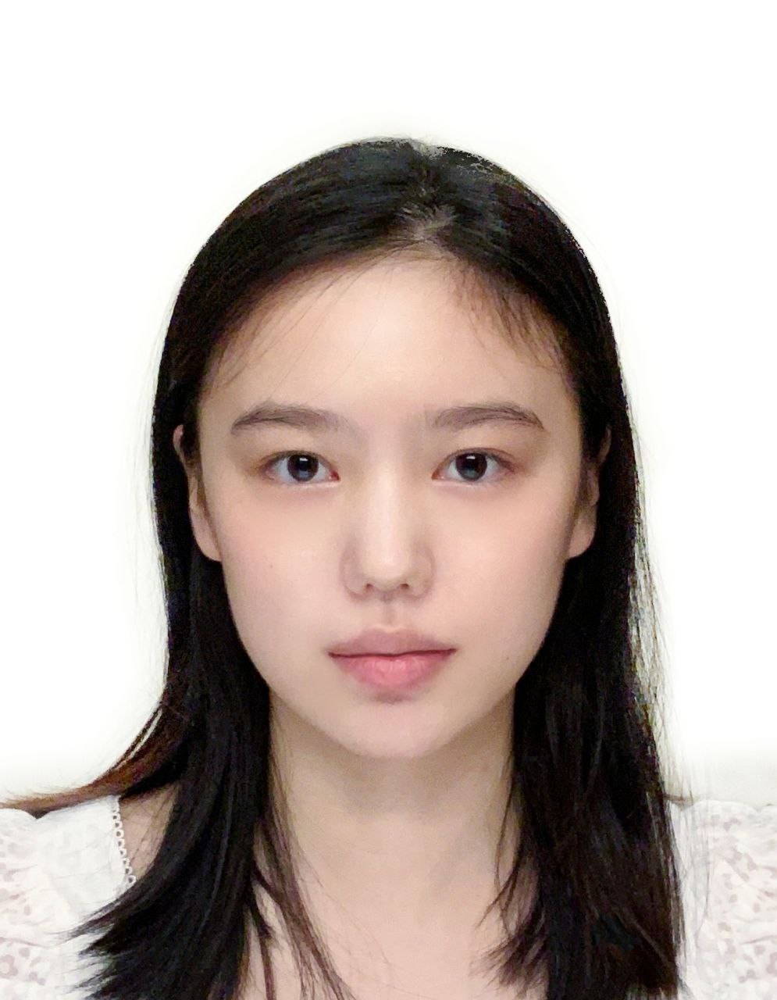

We are a team based in the [School of Computing, National University of Singapore](http://www.comp.nus.edu.sg).

You can reach us at the email `seer[at]comp.nus.edu.sg`

## ImmuniMate Project Team

### Alex Setyawan

[[github](http://github.com/johndoe)]
[[portfolio](team/johndoe.md)]

* Role: Team Lead
* Responsibilities: UI

### Tan Jovan

[[homepage](http:/jovantanyk.dev)]
[[github](https://github.com/jovantanyk)]
[[portfolio](team/johndoe.md)]

* Role: Developer
* Responsibilities: Front-end, Documentation

### Zhang Lanyu

[[github](http://github.com/laney0808)] [[portfolio](team/laney0808.md)]

* Role: Developer
* Responsibilities: Data

### Natalie Leong

[[github](http://github.com/johndoe)]
[[portfolio](team/johndoe.md)]

* Role: Developer
* Responsibilities: Dev Ops + Threading
