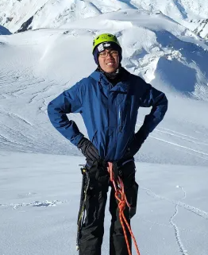
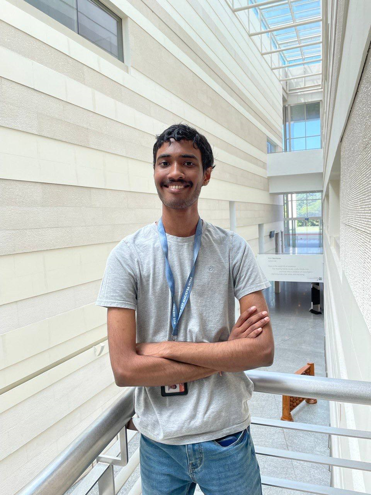
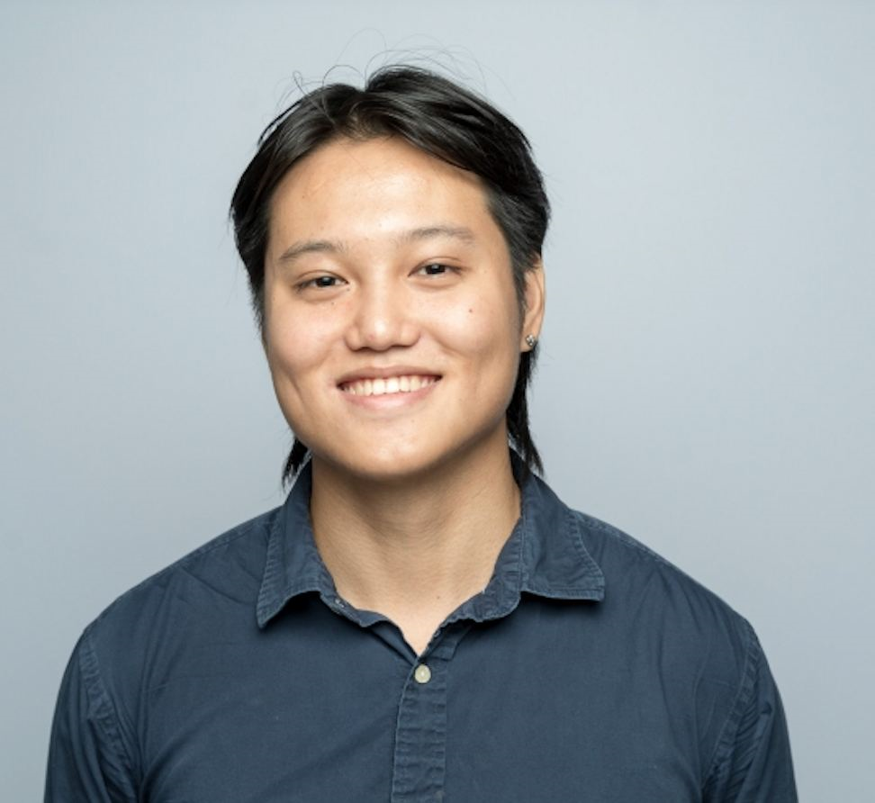
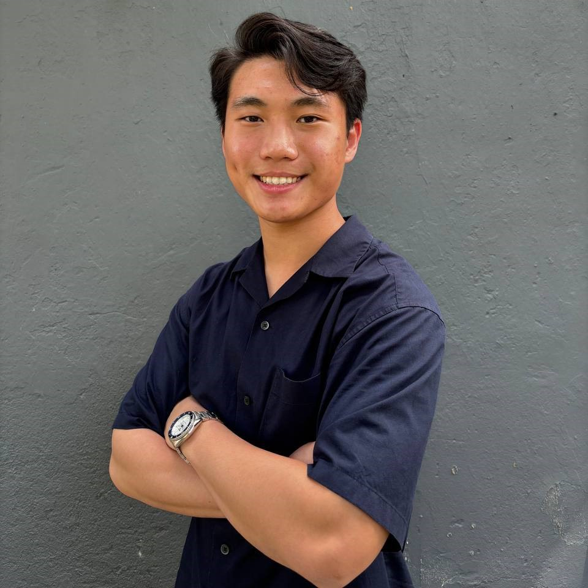

We are a team based in the [School of Computing, National University of Singapore](http://www.comp.nus.edu.sg).

You can reach us at the email `e0959970@u.nus.edu`

## Project team

### Evelyn

[[github](https://github.com/evedaktyl)]
[[portfolio](team/evedaktyl.md)]

* Role: Developer
* Responsiblity: README

### Ryan Chia

[[github](http://github.com/chiaryan)]
[[portfolio](team/chiaryan.md)]

* Role: Developer
* Responsibilities: Create issues

### Laksh

[[github](http://github.com/r-laksh)] 
[[portfolio](team/r-laksh.md)]

* Role: Developer
* Responsibilities: About Us

### Kai

[[github](http://github.com/c-wenlong)]
[[portfolio](team/c-wenlong.md)]
[[Personal Website](https://capyscript.super.site/)]

* Role: Developer
* Responsibilities: UI Design

### Kwun

[[github](http://github.com/kwuunnn)]
[[portfolio](team/kwuunnn.md)]

* Role: Developer
* Responsibilities: User Stories
