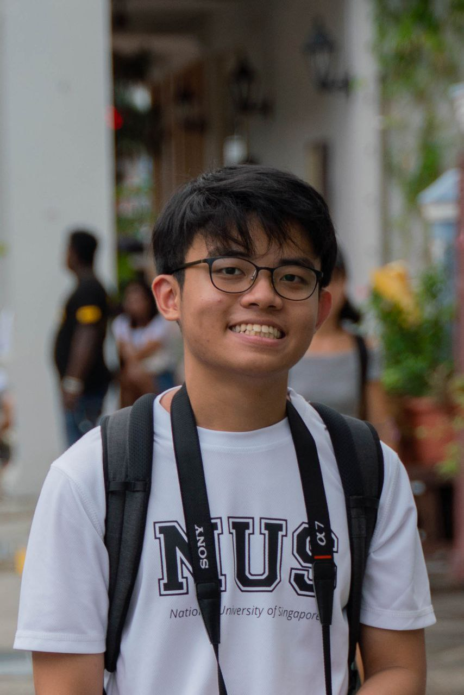
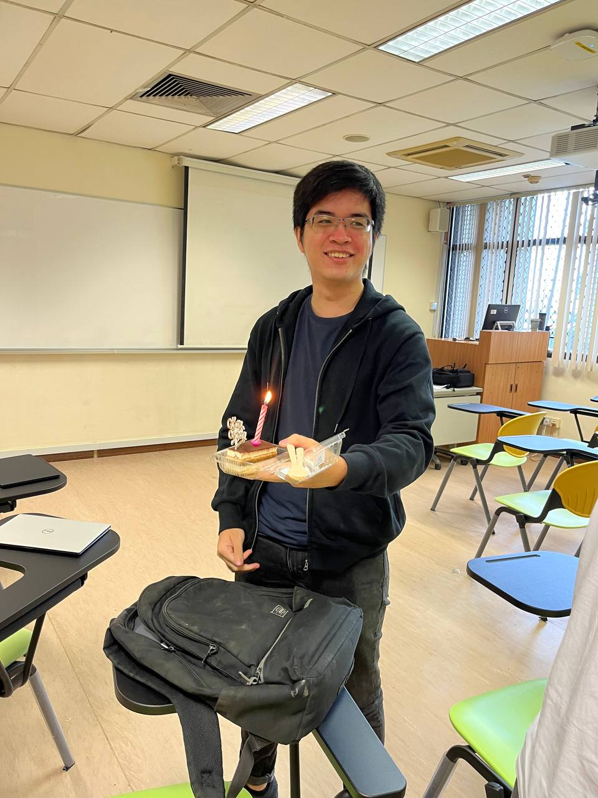
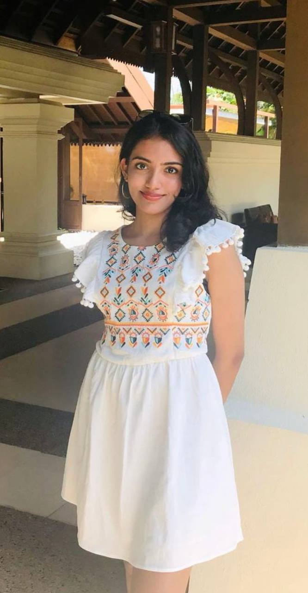
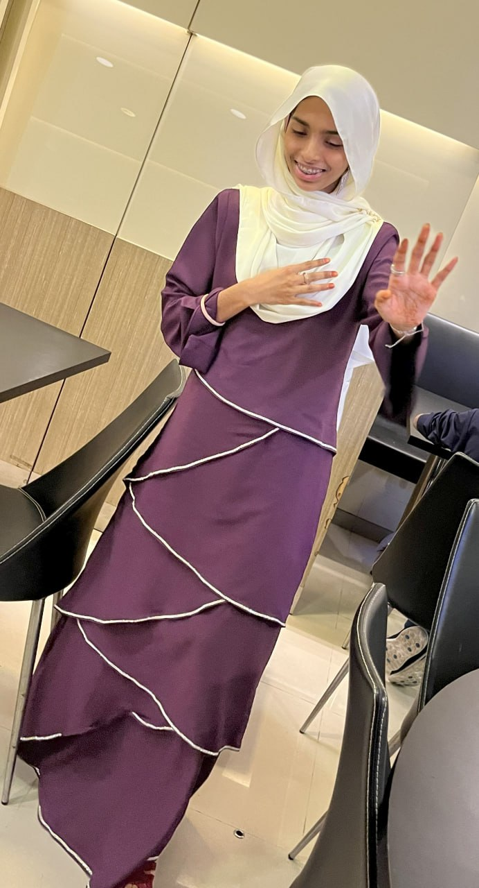
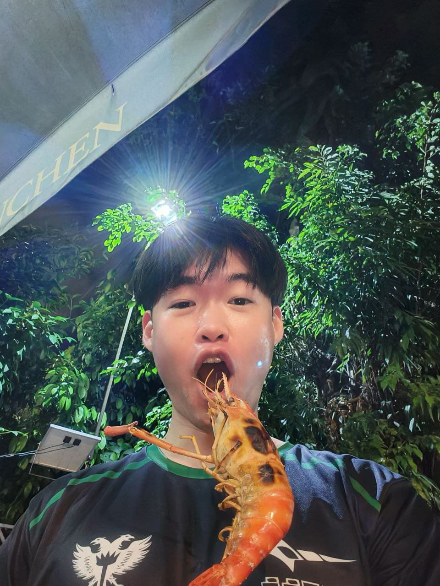

# About Us

We are a team based in the [School of Computing, National University of Singapore](http://www.comp.nus.edu.sg).

## Project team

### Guo Yang

[[github](http://github.com/tanguoyang)]
    
* Role: Team Lead
* Responsibilities: Tracking deliverables

### Song Yee

[[github](http://github.com/angsongyee)] 

* Role: Git Expert
* Responsibilities: Ensure that good Git practices are adhered to

### Tresa

[[github](http://github.com/Teee728)]

* Role: Testing IC
* Responsibilities: Ensure features are well tested

### Sumaiya

[[github](http://github.com/maiyasaliha)]

* Role: Code Quality IC
* Responsibilities: Ensures that good code quality

### Yuechen

[[github](http://github.com/yuechen2001)]

* Role: Documentation IC
* Responsibilities: Ensures that features are well documented
