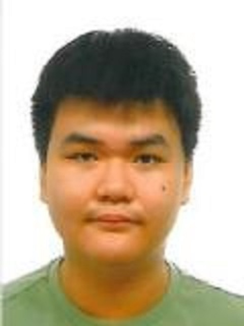
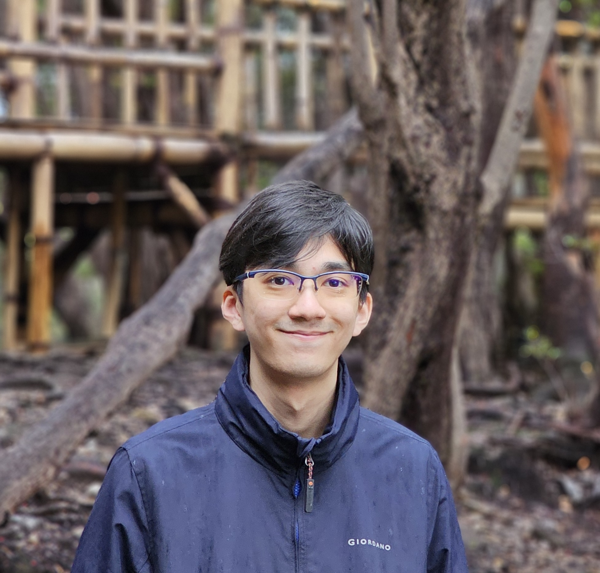
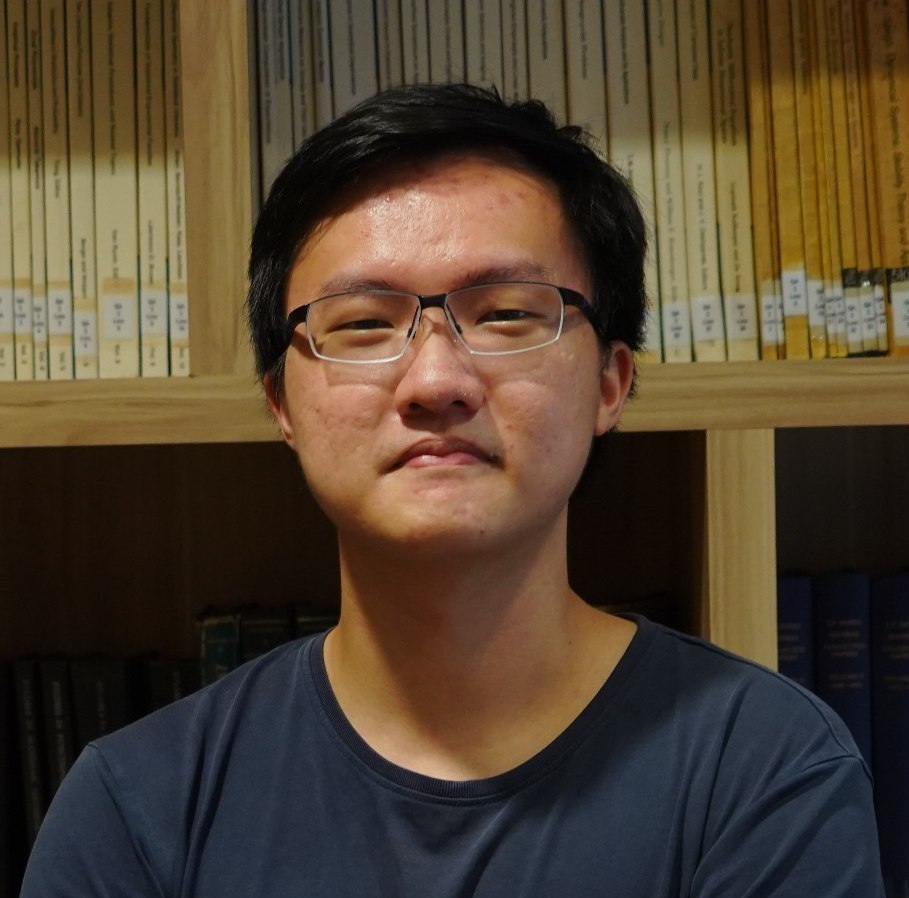
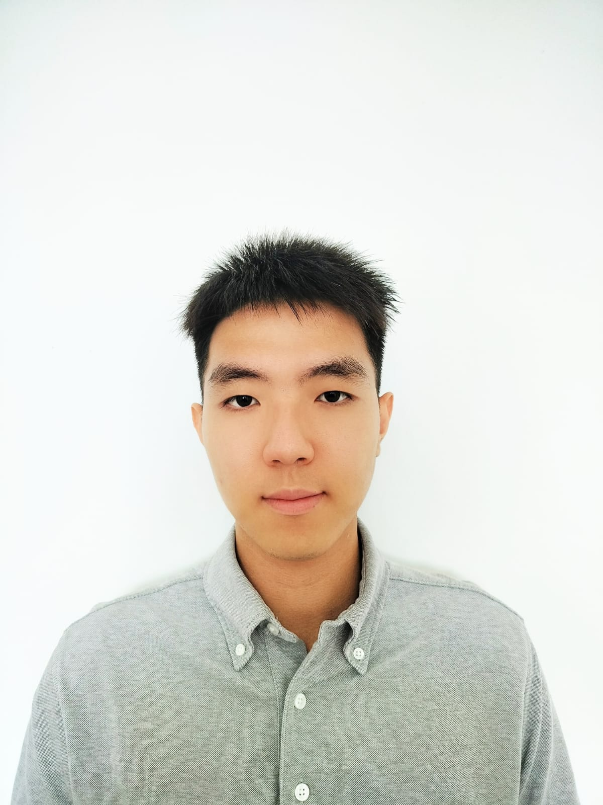

We are a team based in the [School of Computing, National University of Singapore](http://www.comp.nus.edu.sg).

You can reach us at the email `seer[at]comp.nus.edu.sg`

## Project team

### Khor Jun Wei

[[github](https://github.com/kjw142857)]
[[portfolio](https://github.com/kjw142857)]

* Role: Developer
* Responsibilities: TBC

### Kyal Sin Min Thet

[[github](http://github.com/marcus-ny)]
[[portfolio](http://github.com/marcus-ny)]

* Role: Developer
* Responsibilities: TBC

### Teoh Tze Tzun

[[github](https://github.com/Joseph31416)] [[portfolio](https://github.com/Joseph31416)]

* Role: Developer
* Responsibilities: Data

### Wang Junwu

[[github](http://github.com/narwhalsilent)]
[[portfolio](http://github.com/narwhalsilent)]

* Role: Developer
* Responsibilities: TBC

### Zhang Xiaorui

[[github](https://github.com/xiaorui-ui)]
[[portfolio](https://github.com/xiaorui-ui)]

* Role: Developer
* Responsibilities: TBC
