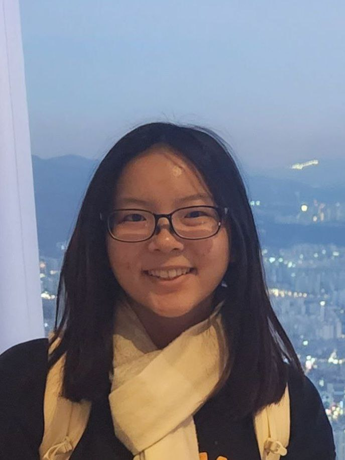
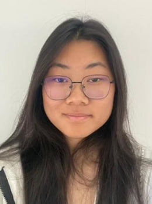

# About Us

We are a team based in the [School of Computing, National University of Singapore](http://www.comp.nus.edu.sg).

You can reach us at the email `seer[at]comp.nus.edu.sg`

## Project team

### Ashley Goh

[[github](http://github.com/ashleygoh1)]
[[portfolio](team/ashley.md)]

* Role: Developer
* Responsibilities: Model

### Chai Ming How

[[github](http://github.com/minghowC)] 
[[portfolio](team/minghow.md)]

* Role: Developer
* Responsibilities: Data

### Chen Yixin

[[github](http://github.com/chenyixin0)]
[[portfolio](team/yixin.md)]

* Role: Developer
* Responsibilities: Dev Ops + Threading

### Eunice Koh

[[github](http://github.com/eunrcn)]
[[portfolio](team/eunice.md)]

* Role: Developer
* Responsibilities: UI

### Jawad Afthab

[[github](http://github.com/Jawad280)]
[[portfolio](team/jawad.md)]

* Role: Developer
* Responsibilities: UI
