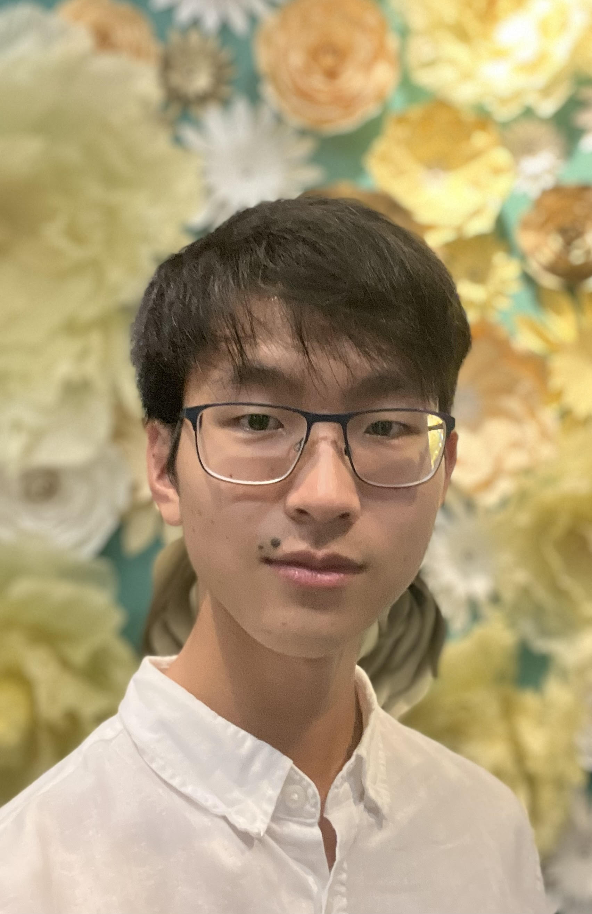
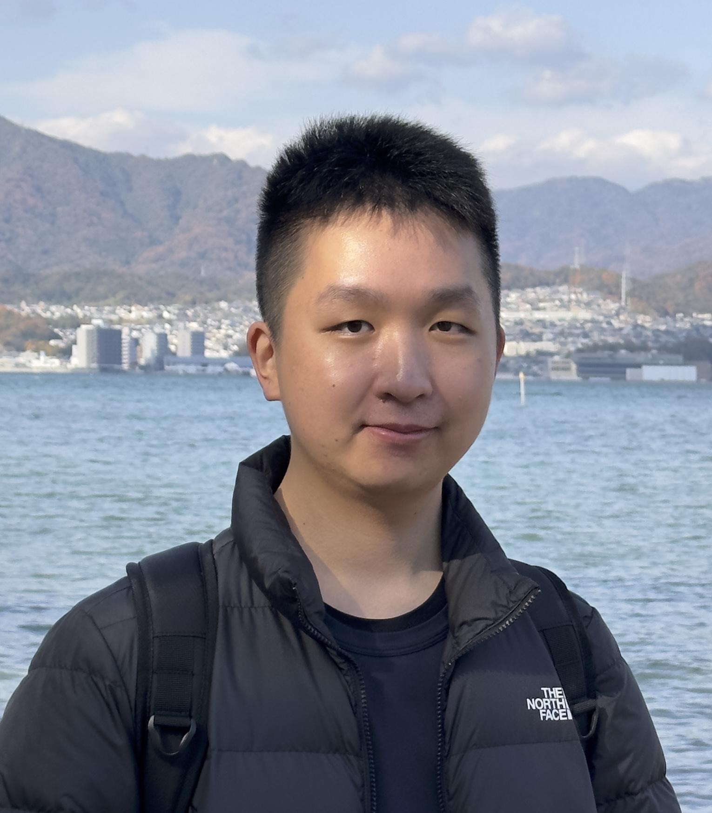
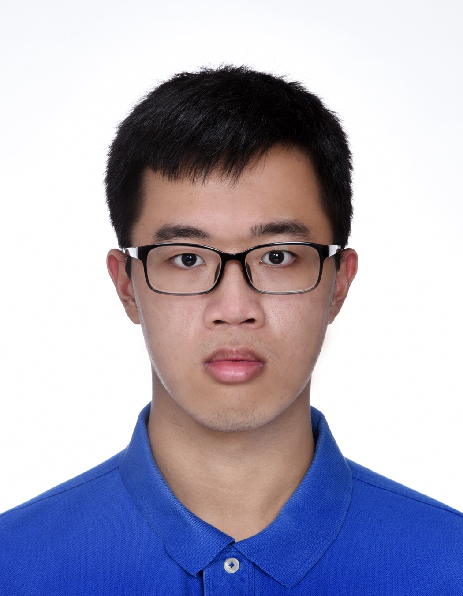

We are a team based in the [School of Computing, National University of Singapore](http://www.comp.nus.edu.sg).

You can reach us at the email `seer[at]comp.nus.edu.sg`

## Project team

### Chin Zhe Ning

[[github](https://github.com/biinnnggggg)]

* Roles: Documentation, In charge of `Logic`
* Responsibilities: looks after quality of various project documents, diagrams and the `Logic` component
### Jonathan Chong

[[github](http://github.com/jonchong98)]

* Roles: User Interface design and implementation
* Responsibilities: creating UI mockups and implementing design into product

### Darylgolden

[[github](http://github.com/darylgolden)]

* Roles: Git expert, Testing, Integration
* Responsibilities: helps other team member with Git matters, ensures
  the testing of the project is timely and done properly, In charge of
  versioning of the code, maintaining the code repository, integrating
  various parts of the software to create a whole.

### Aidan Goh

[[github](https://github.com/TopKec)]

* Role: Code Quality, In charge of `Model` package
* Responsibilities: looks after code quality, ensures adherence to coding
standards, etc., looks after quality of `Model` package

### Tan Qin Yong

[[github](http://github.com/tanqinyong)]

* Role:  Scheduling and Tracking
* Responsibilities: in charge of defining, assigning and tracking of tasks
