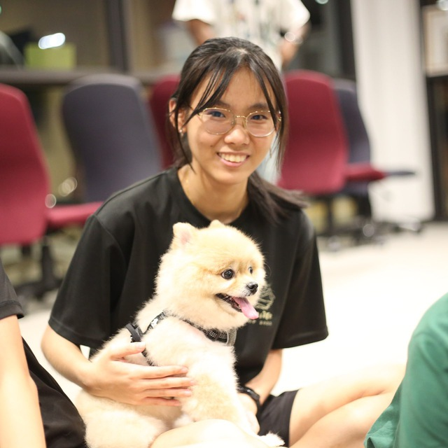
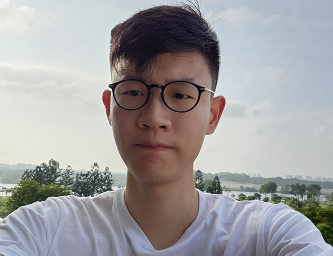

We are a team based in the [School of Computing, National University of Singapore](http://www.comp.nus.edu.sg).

You can reach us at the email `seer[at]comp.nus.edu.sg`

## Project team

### Lim Xiu Jia

[[github](https://github.com/tsulim)]
[[portfolio](team/tsulim.md)]

* Role: Developer
* Responsibilities: Scheduling and tracking

### Calista Wong

[[github](https://github.com/whitesnowx)]
[[portfolio](team/whitesnowx)]

* Role: Developer
* Responsibilities: Documentation and organisation

### Li Xinyi 

[[github](http://github.com/iynixil)] [[portfolio](team/iynixil.md)]

* Role: Developer
* Responsibilities: Documentation Quality Assurance

### Jerry Wang

[[github](http://github.com/JerryWang0000)]
[[portfolio](team/jerrywang0000)]

* Role: Backend Developer
* Responsibilities: Development of Functionalities

### Norton Ng

[[github](http://github.com/Pluiexo)]
[[portfolio](team/pluiexo.md)]

* Role: Developer
* Responsibilities: Development of UI/UX and Integration, Lead
