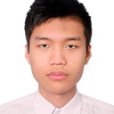
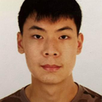
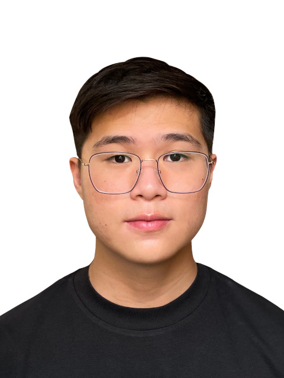
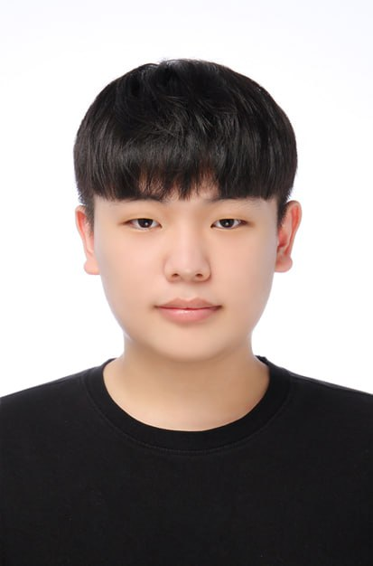

---
---

We are a team based in the [School of Computing, National University of Singapore](http://www.comp.nus.edu.sg).

## CS2103T T11-2 Team Members

### Reet Mitra

[[Github](https://github.com/reetmitra)]

* Role: Developer
* Responsibilities: Documentation

### Bui Hong Duc

[[Github](https://github.com/E0735389)]

* Role: Team Developer
* Responsibilities: UI

### Chong Chan How

[[Github](https://github.com/ChillinRage)]

* Role: Developer
* Responsibilities: Data

### Timothy Soh Yee Song

[[Github](https://github.com/LargeCrowd)]

* Role: Developer
* Responsibilities: Dev Ops + Threading

### Yang Heebom

[[Github](https://github.com/Hibeom0929)]

* Role: Developer
* Responsibilities: Deliverables and Deadlines 
