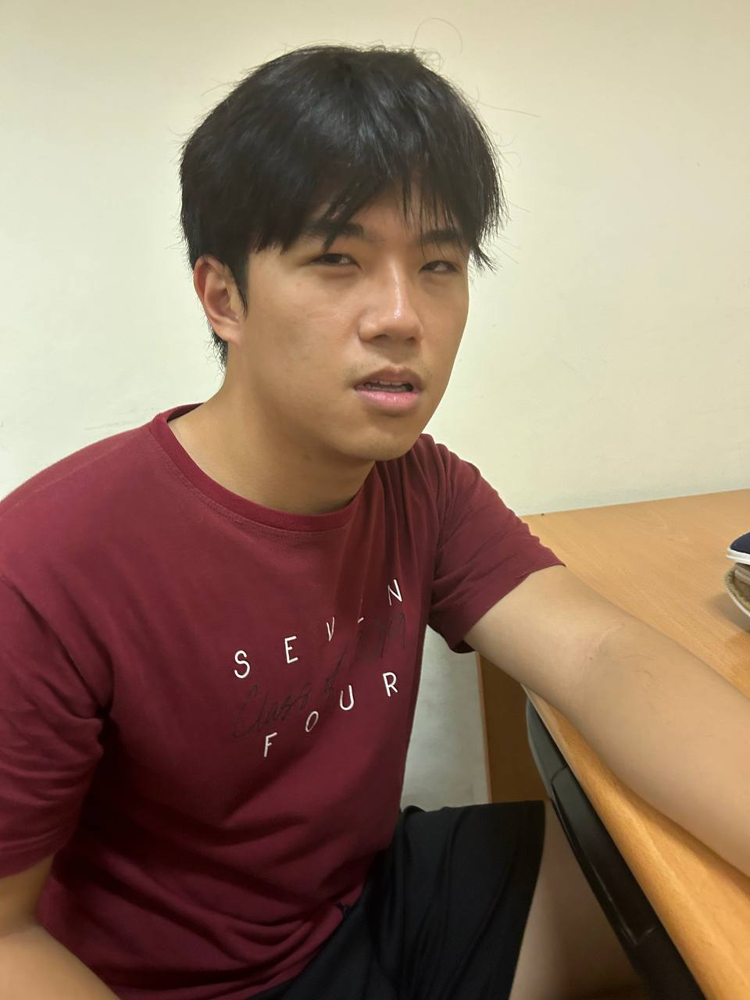
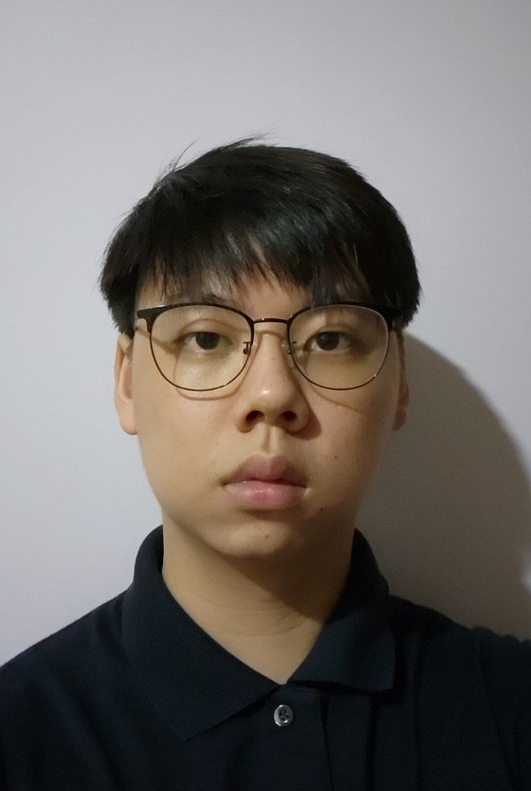
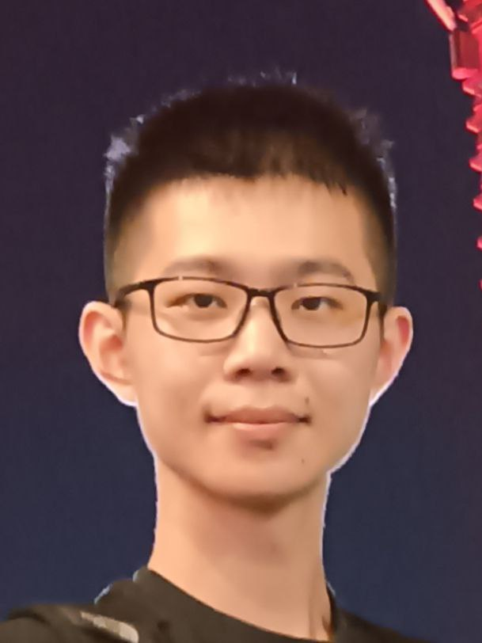

We are a team based in the [School of Computing, National University of Singapore](http://www.comp.nus.edu.sg).
[[Project Website](https://ay2324s2-cs2103t-t08-2.github.io/tp/)]
## Strack.io

### Nigel Lim

[[github](https://github.com/nigel27022001)]
[[portfolio](team/nigel.md)]

* Role: Team Lead
* Responsibilities: Scheduling and tracking, Deliverables and deadlines

### Joel Wang

[[github](http://github.com/joelwang22)]
[[portfolio](team/joel.md)]

* Role: Developer
* Responsibilities: Documentation

### Isaac Chong

[[github](http://github.com/chonghaoen)] [[portfolio](team/isaac.md)]

* Role: Developer
* Responsibilities: Testing

### Yang Yibai

[[github](http://github.com/0-yibai)]
[[portfolio](team/yibai.md)]

* Role: Developer
* Responsibilities: Integration

### Bertrand Ong

[[github](http://github.com/bertrandong)]
[[portfolio](team/bertrand.md)]

* Role: Developer
* Responsibilities: Code Quality
