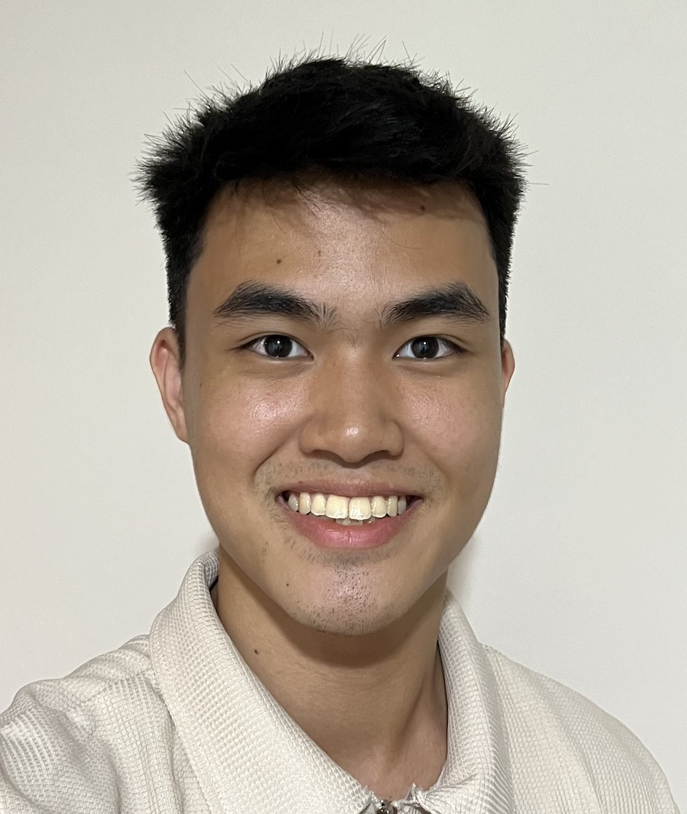
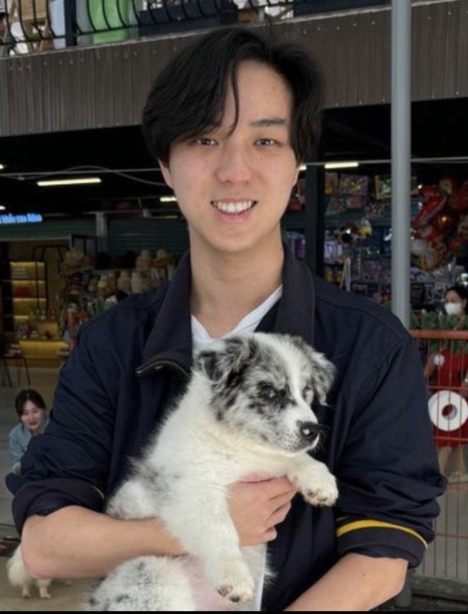
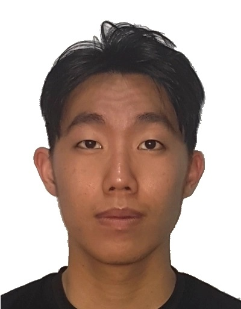
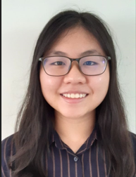

# About Us

We are a team based in the [School of Computing, National University of Singapore](http://www.comp.nus.edu.sg).

You can reach us at the email `seer[at]comp.nus.edu.sg`

## Project team

### Ang Zi Jun Dayn

[[github](https://github.com/dayn-1)]

* Role: Testing

### Chee Wei Xiong Clifton

[[github](http://github.com/cliftonchee)]

* Role: Documentation
* Responsibilities: UI

### Jaime Ng Jia Min

[[github](http://github.com/thatgirljam)]

* Role: Scheduling and Tracking
* Responsibilities: Data

### Lim Rik

[[github](http://github.com/limrik)]

* Role: Code quality
* Responsibilities: Dev Ops + Threading

### Low Xue Ling

[[github](http://github.com/xuelinglow)]

* Role: Integration
* Responsibilities: UI
