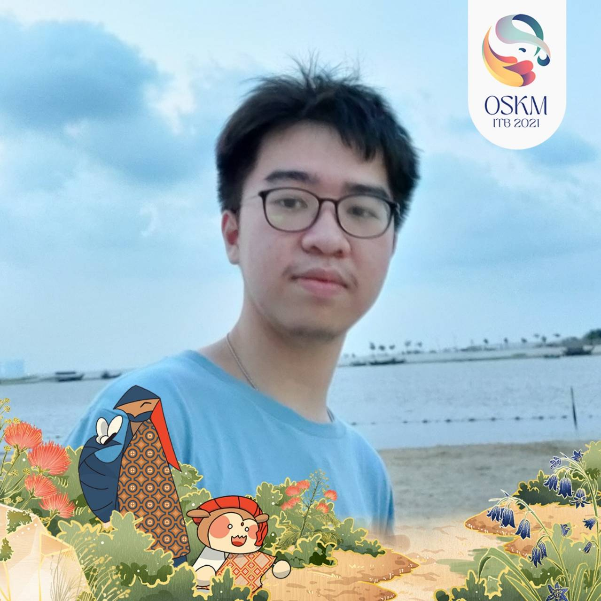
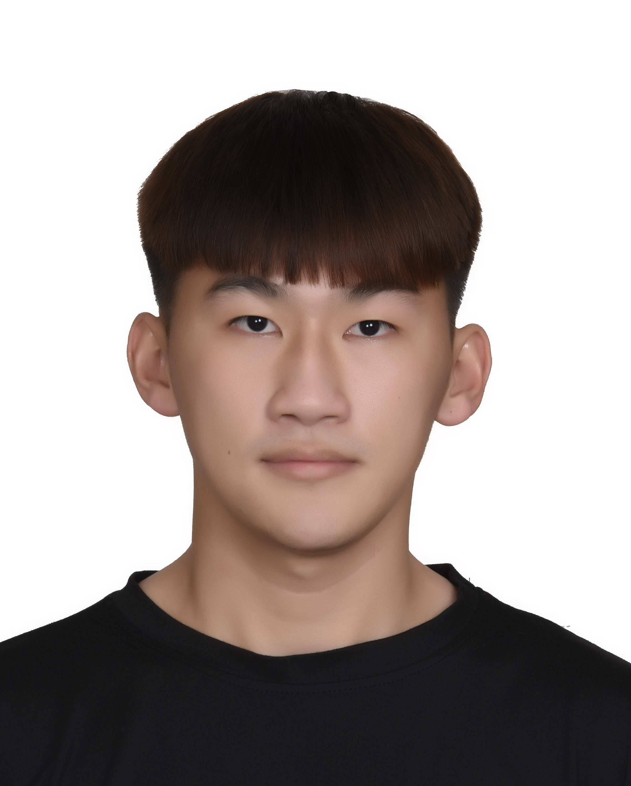

We are a team based in the [School of Computing, National University of Singapore](http://www.comp.nus.edu.sg).

You can reach us at the email `e0960005@comp.nus.edu`

## Project team

### Lim Zi Jia

[[github](https://github.com/limzijia)]

* Role: Developer
* Responsibilities: Testing + logic

### Gerard Jeremiah Matthew

[[github](https://github.com/GERARDJM018)]

* Role: Developer
* Responsibilities: Scheduling and Tracking + Model

### Go Song Ying

[[github](https://github.com/gosongying)]

* Role: Developer
* Responsibilities: Deliverables and deadlines + UI

### Jane Doe

[[github](http://github.com/johndoe)]
[[portfolio](team/johndoe.md)]

* Role: Team Lead
* Responsibilities: UI

### Johnny Doe

[[github](http://github.com/johndoe)] [[portfolio](team/johndoe.md)]

* Role: Developer
* Responsibilities: Data

### Jean Doe

[[github](http://github.com/johndoe)]
[[portfolio](team/johndoe.md)]

* Role: Developer
* Responsibilities: Dev Ops + Threading

### James Doe

[[github](http://github.com/johndoe)]
[[portfolio](team/johndoe.md)]

* Role: Developer
* Responsibilities: UI
