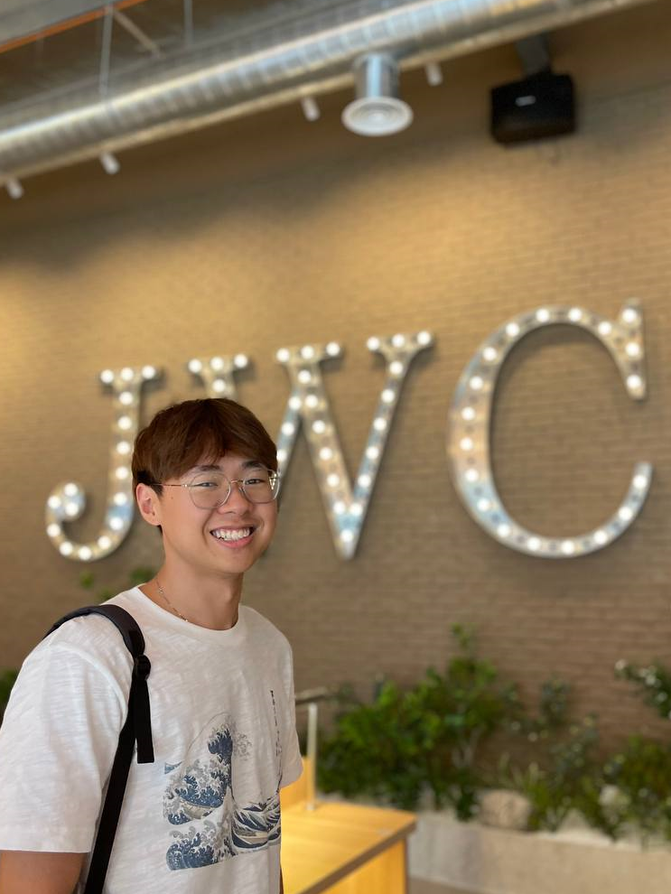
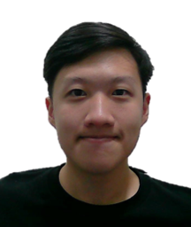
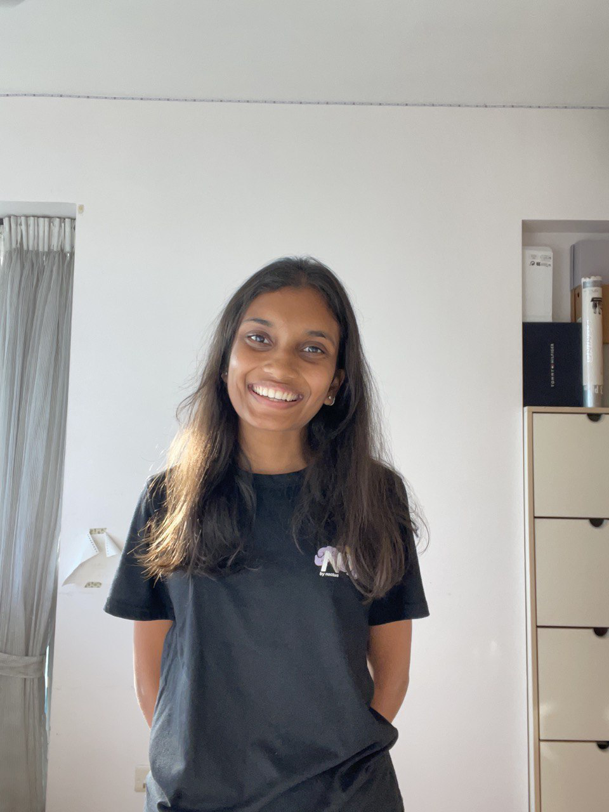

We are a team based in the [School of Computing, National University of Singapore](http://www.comp.nus.edu.sg).

You can reach us at the email `seer[at]comp.nus.edu.sg`

## Project team

### Lim Kok Liang

[[github](http://github.com/kokerinks)] [[linkedin](https://www.linkedin.com/in/lim-kok-liang/)]

* Role: Testing, Integration
* Responsibilities:

### Billy Ho Cheng En

[[github](http://github.com/billyhoce)]
[[portfolio](team/billyho.md)]

* Role: Team lead, Deliverables and deadlines
* Responsibilities:

### Khushi Bhagwat

[[github](http://github.com/kab-dot)] 
[[portfolio](team/khushibhagwat.md)]

* Role: Documentation, Scheduling
* Responsibilities:

### Kinjal Agarwal

[[github](http://github.com/kinjalagarwal1810)]
[[portfolio](team/kinjalagarwal1810.md)]

* Role: Code Quality
* Responsibilities:
