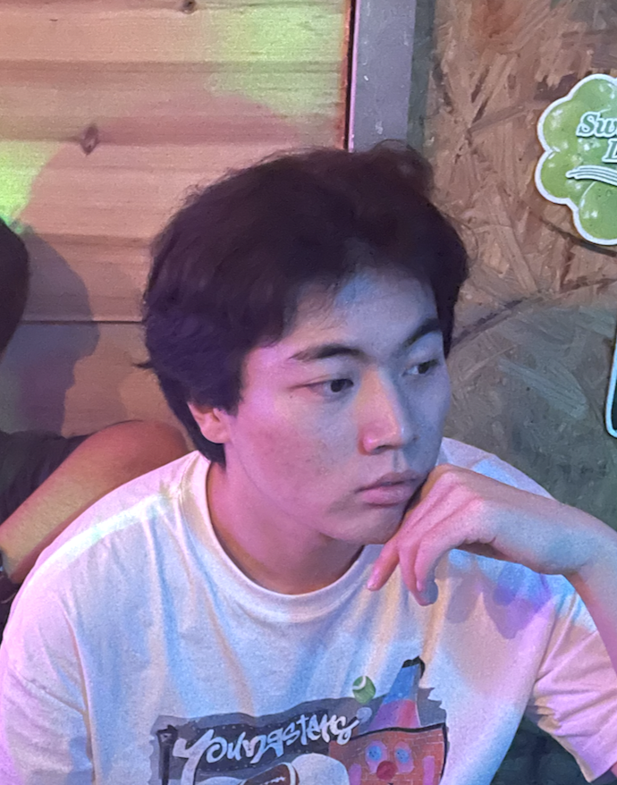
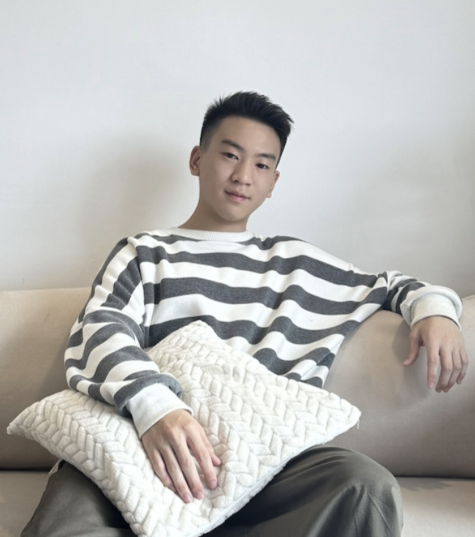

We are a team based in the [School of Computing, National University of Singapore](http://www.comp.nus.edu.sg).

You can reach us at the email `seer[at]comp.nus.edu.sg`

## Project team

### Zhiyang Lu

[[homepage](www.linkedin.com/in/zhiyanglu)]
[[github](https://github.com/alfaloo)]
[[portfolio](https://github.com/alfaloo/CV/blob/main/Zhiyang_Lu_Resume.pdf)]

* Role: Deliverables and Deadline / Integration
* Responsibilities: Ensure project deliverables are done on time and in the right format. In charge of versioning of the code, maintaining the code repository, integrating various parts of the software to create a whole.

### Cheng-Yu Dong

[[github](https://github.com/officialchengyud)]
[[portfolio](www.linkedin.com/in/dongchengyu)]

* Role: Code Quality / Integration
* Responsibilities: Looks after code quality, ensures adherence to coding standards, etc. In charge of versioning of the code, maintaining the code repository, integrating various parts of the software to create a whole.

### Lim Jia Wei

[[github](http://github.com/Kappaccinoh)] [[portfolio](https://www.linkedin.com/in/jia-wei-lim-747037181/)]

* Role: Scheduling / Testing
* Responsibilities: Ensures the testing of the project is done properly and on time. In charge of defining, assigning, and tracking project tasks.

### Jean Doe

[[github](http://github.com/johndoe)]
[[portfolio](team/johndoe.md)]

* Role: Developer
* Responsibilities: Dev Ops + Threading

### James Doe

[[github](http://github.com/johndoe)]
[[portfolio](team/johndoe.md)]

* Role: Developer
* Responsibilities: UI
