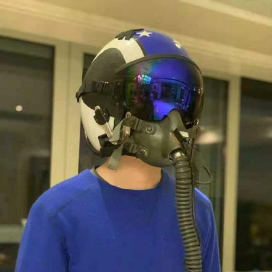
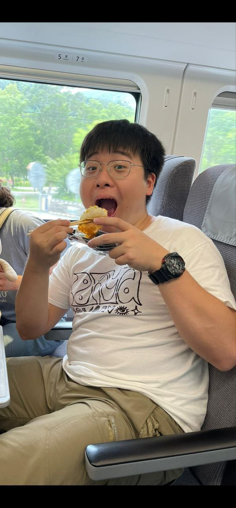

We are a team based in the [School of Computing, National University of Singapore](http://www.comp.nus.edu.sg).

You can reach us at the email `seer[at]comp.nus.edu.sg`

## Project team

### Zhang Tianyao

[[homepage](https://github.com/ZHANGTIANYAO1)]
[[github](https://github.com/ZHANGTIANYAO1)]
[[portfolio](team/zhangtianyao.md)]

* Role: Project Advisor

### Mahathir Norrahim

[[github](https://github.com/dabzpengu)]

* Role: Team Lead
* Responsibilities: UI / Quality Assurance

### Tan Yi Jing

[[github](http://github.com/Lalelulilulela)] [[portfolio](team/lalelulilulela.md)]

* Role: Developer
* Responsibilities: Data

### Ashley Chua Xin Ru

[[github](http://github.com/ashleyy2444)]
[[portfolio](team/ashley.md)]

* Role: Developer
* Responsibilities: Dev Ops + Threading

### Dexter Wong

[[github](http://github.com/Dexter-Wong)]
[[portfolio](team/dexter.md)]

* Role: Developer
* Responsibilities: UI
