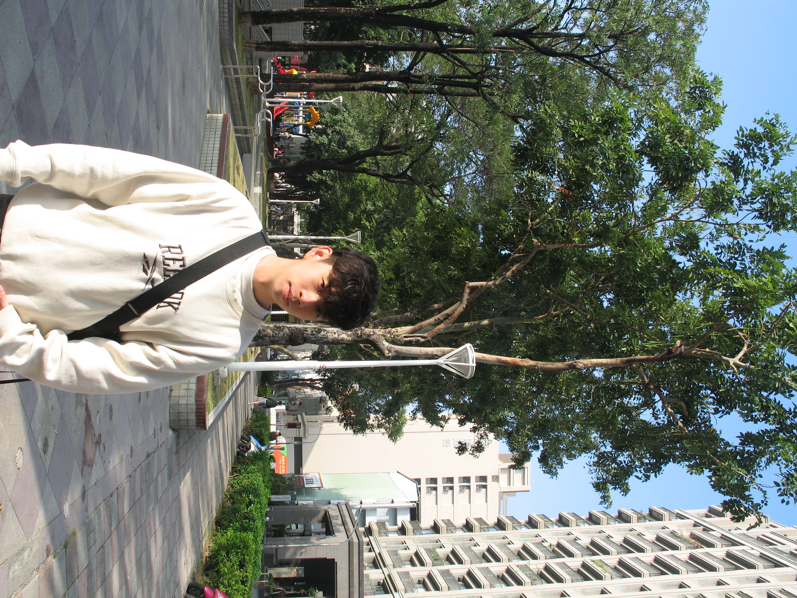

# About Us

We are a team based in the [School of Computing, National University of Singapore](http://www.comp.nus.edu.sg).

You can reach us at the email `seer[at]comp.nus.edu.sg`

## Project team

### Jared Wong

[[homepage](https://jajared.vercel.app/)]
[[github](https://github.com/Jajared)]
[[portfolio](team/johndoe.md)]

* Role: Team Lead
* Responsibilities: Overall project coordination and ensure the team is doing well.
### Zack Tay

[[github](http://github.com/johndoe)]
[[portfolio](team/johndoe.md)]

* Role: Code quality
* Responsibilities: Responsible for the quality of various project documents, including README, User Guide and Developer Guide.

### Tan Qin Xu

[[github](http://github.com/johndoe)] [[portfolio](team/johndoe.md)]

* Role: Documentation
* Responsibilities: Looks after code quality, ensures adherence to coding standards, etc. Also in charge of reviewing PRs and testing of project code before upload

### Whelan Low

[[github](http://github.com/whelan-low)]
[[portfolio](team/johndoe.md)]

* Role: Deliverables and deadlines
* Responsibilities: Ensure project deliverables are done on time and in the right format. In charge of submitting the deliverables

### Mahadhir

[[github](http://github.com/johndoe)]
[[portfolio](team/johndoe.md)]

* Role: Code quality
* Responsibilities: Looks after code quality, ensures adherence to coding standards, etc. Also in charge of reviewing PRs and testing of project code before upload
