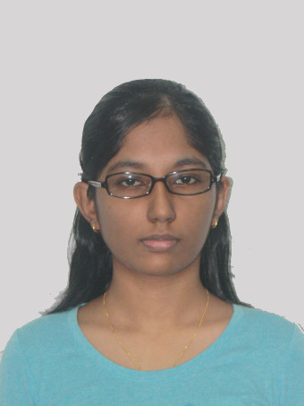
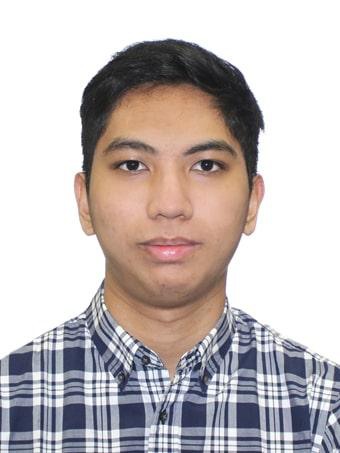
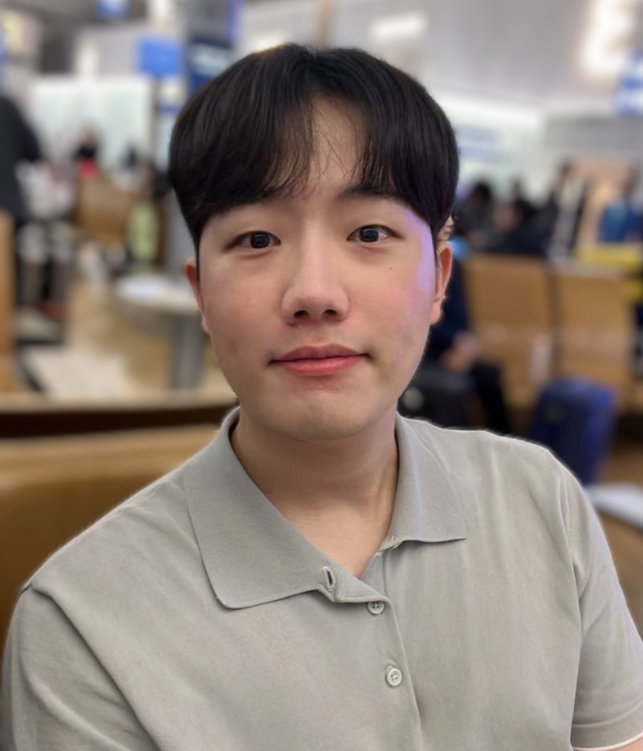
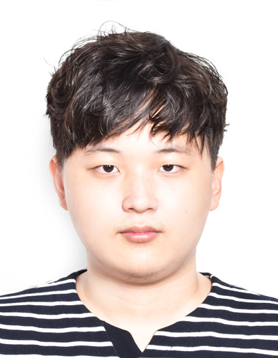

# About Us

We are a team based in the [School of Computing, National University of Singapore](http://www.comp.nus.edu.sg).

You can reach us at the email `seer[at]comp.nus.edu.sg`

## Project team

### Sivakumar Aishvarya

[[github](https://github.com/S-Aishvarya)]

* Role: Developer
* Responsibilities: Scheduling and tracking + Documentation + Commons

### Eugene Hirose

[[github](http://github.com/Vision-2000)]
[[portfolio](team/johndoe.md)]

* Role: Developer
* Responsibilities: Testing + UI + Logic

### Jeong Jaeho

  

[[github](http://github.com/jeong-jaeho)]
[[portfolio](team/johndoe.md)]

* Role: Developer
* Responsibilities: Team lead + Integration + Storage

### Kim Junseo

[[github](https://github.com/jskimdev)]
[[portfolio](team/johndoe.md)]

* Role: Developer
* Responsibilities: Code Quality + Model + JavaFX visuals
