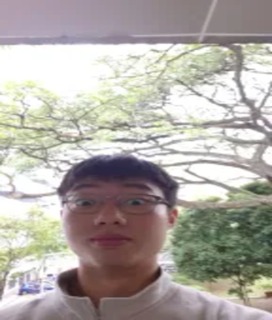
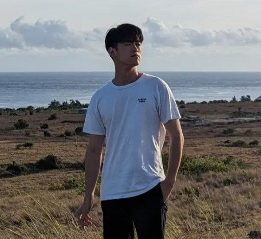
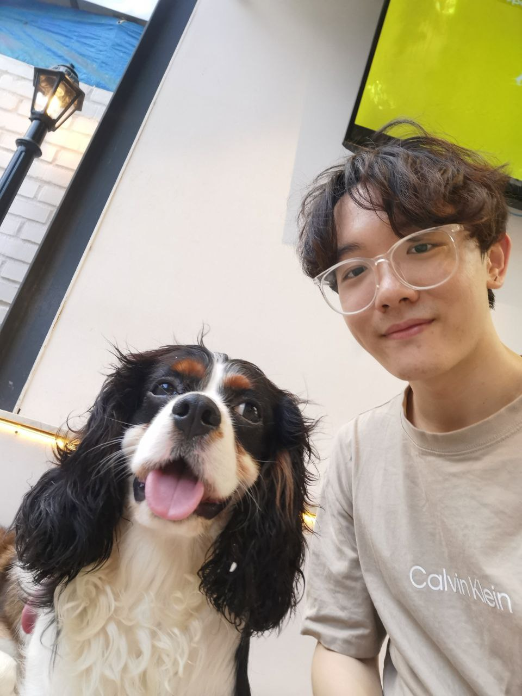

# About Us

We are a team based in the [School of Computing, National University of Singapore](http://www.comp.nus.edu.sg). To learn good software engineering practies, we have different team leads each week. This week's team lead is Shuyuan.

You can reach us at the email `seer[at]comp.nus.edu.sg`

## Project team

### Boan

[[homepage](http://www.comp.nus.edu.sg/~damithch)]
[[github](https://github.com/qinboan)]
[[portfolio](team/johndoe.md)]

* Role: Algorithms & Data Structures
* Responsibilities: Algorithms & Data Structures

### Jun Yuan

[[github](https://github.com/chengjunyuan)] [[linkedin](https://www.linkedin.com/in/jun-yuan-cheng-2867931a9/)]

Interested in computational biology and bioinformatics!

* Role: Team Lead
* Responsibilities: UI

### Min Rei

[[github](http://github.com/minreiseah)] [[portfolio](team/minrei.md)]

* Role: Developer
* Responsibilities: Data

### Sampson

[[github](http://github.com/SampsonYe1999)]
[[portfolio](team/sampsonye.md)]

* Role: Developer
* Responsibilities: Dev Ops + Threading

### Shuyuan

[[github](http://github.com/legionlegion)]
[[portfolio](team/legionlegion.md)]

* Role: Developer
* Responsibilities: UI
