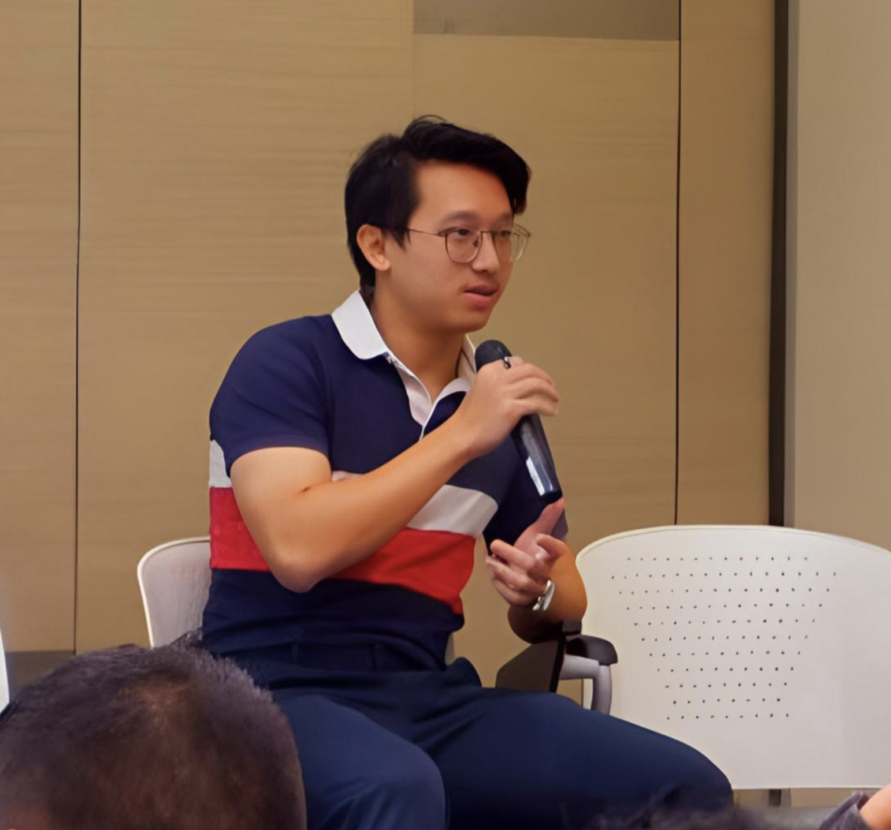
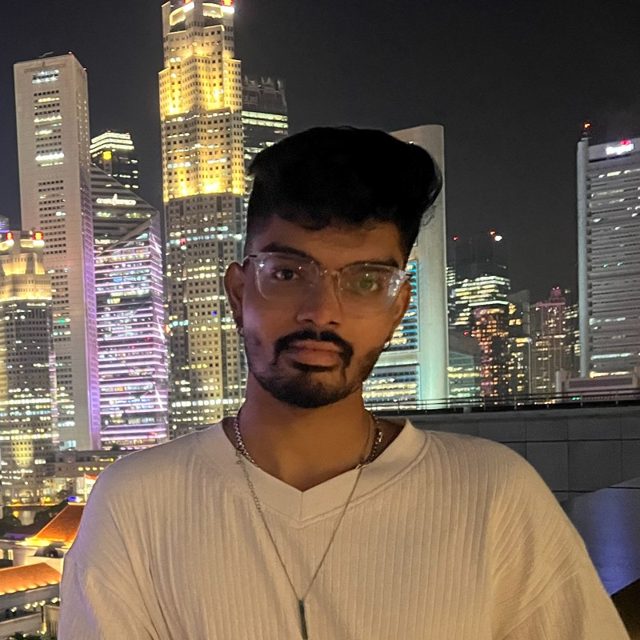
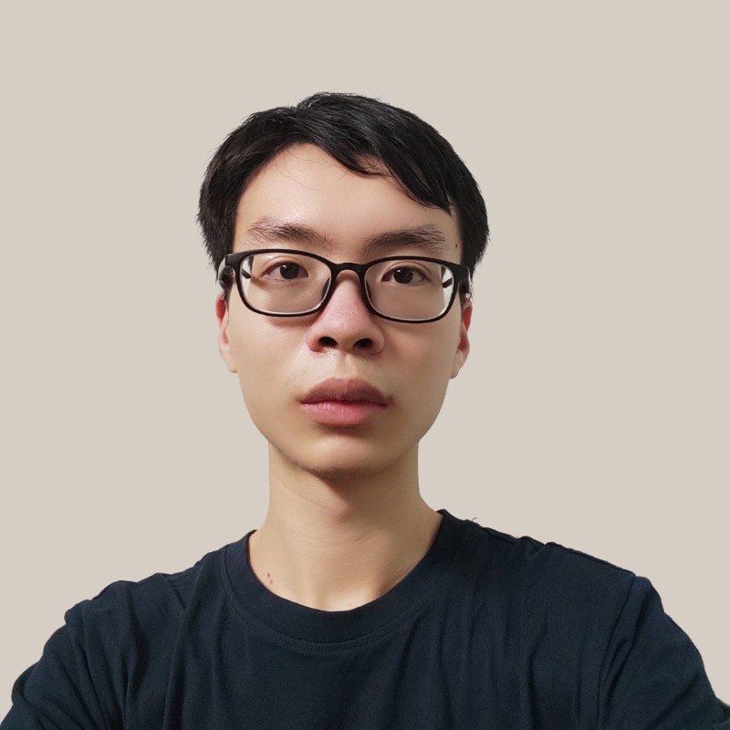
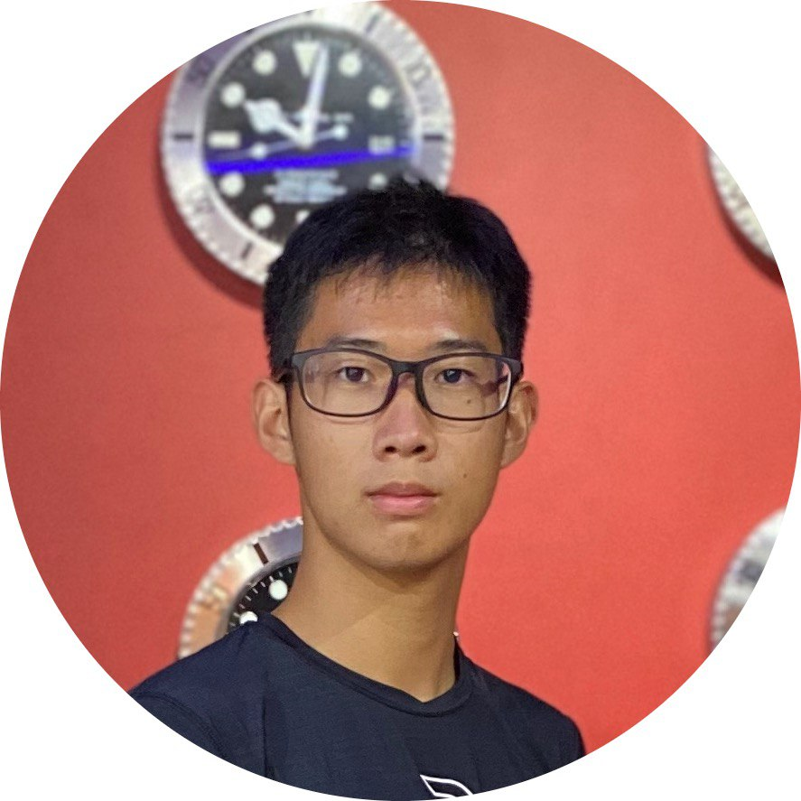
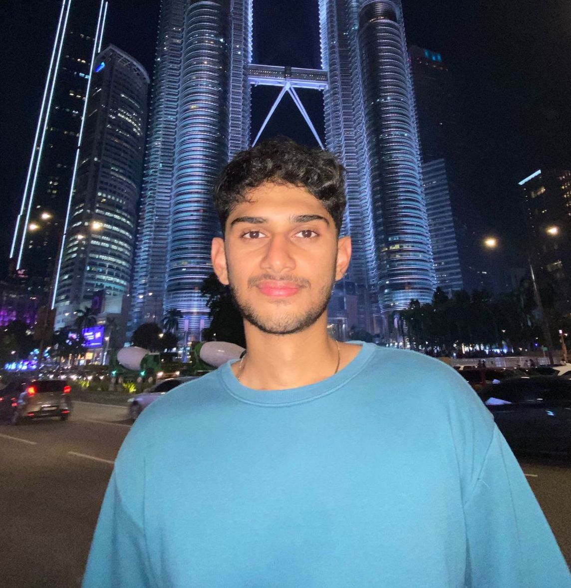

# About Us

We are a team based in the [School of Computing, National University of Singapore](http://www.comp.nus.edu.sg).

You can reach us at the email `seer[at]comp.nus.edu.sg`

## Project team

### Ethan Wei Yuxin

[[homepage](http://www.ethanwei.me)]
[[github](https://github.com/belligerentbeagle)]
[[portfolio](team/ethanwei.md)]

* Role: Software Engineer
* Responsibilities: Software Development

### Sai Utkarsh

[[github](https://github.com/saiutkarsh33)]
[[portfolio](team/sai.md)]

* Role: Software Engineer
* Responsibilities: Software Development

### Titus Chew 

[[github](http://github.com/tituschewxj)] 
[[portfolio](team/titus.md)]

* Role: Software Engineer
* Responsibilities: Software Development

### Wu Xiaoyun

[[github](http://github.com/ForAeons)]
[[portfolio](team/xiaoyun.md)]

* Role: Software Engineer
* Responsibilities: Software Development

### Anant Shanker

[[github](http://github.com/anant1902)]
[[portfolio](team/anant.md)]

* Role: Software Engineer
* Responsibilities: Software Development

