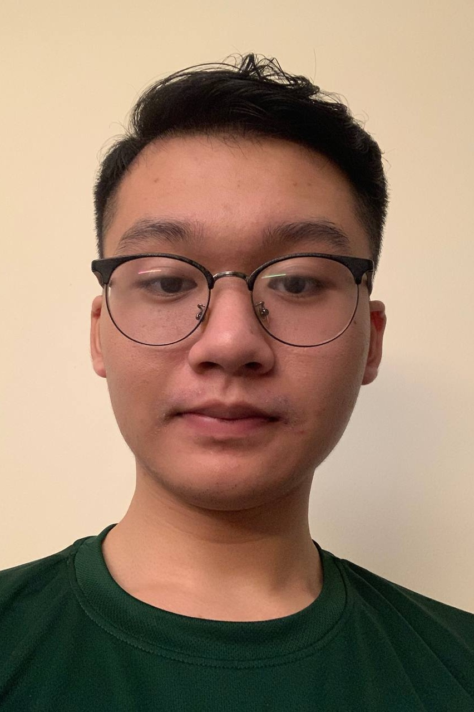
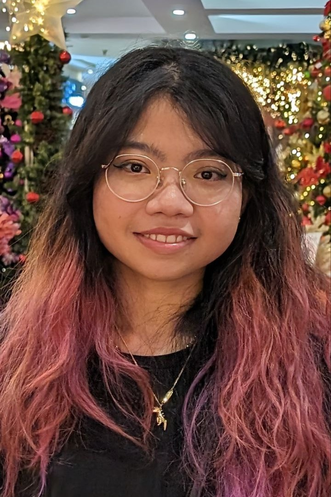
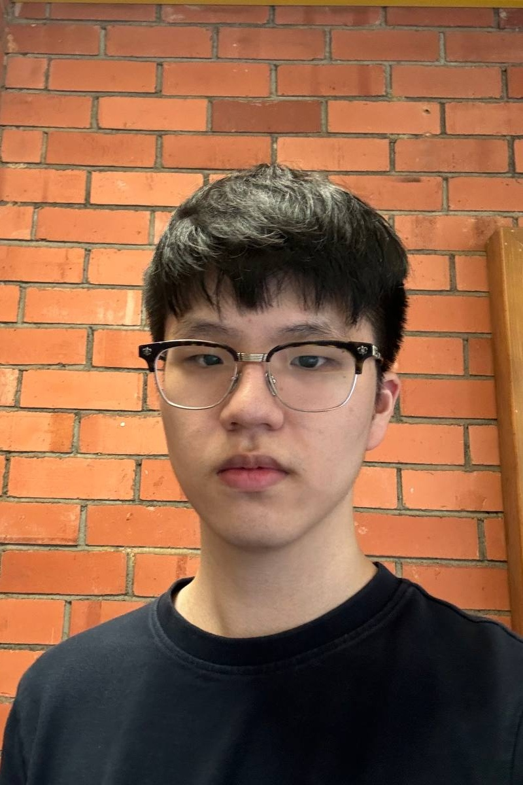

# About Us

**HackLink** - a java application that help Student Hackathon organizers seamlessly handle participant, 
staff, and sponsor details, ensuring every event runs smoothly.

We are a team based in the [School of Computing, National University of Singapore](http://www.comp.nus.edu.sg).

Tutor: Tan Wei Zhe

## Project team

### Bach Le Tuan Khai

[[github](https://github.com/bachletuankhai)]

* Role: Developer
* Responsibilities: Model

### Julia Christy Purba

[[github](https://github.com/julia-cp)]

* Role: Developer
* Responsibilities: UI

### Lee Donghyun

[[github](https://github.com/dhlee03)]

* Role: Developer
* Responsibilities: Data

### Premakumar Meenu Lekha

[[github](https://github.com/meenulekha)]

* Role: Developer
* Responsibilities: Storage
