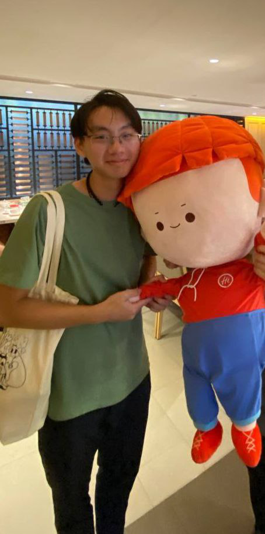
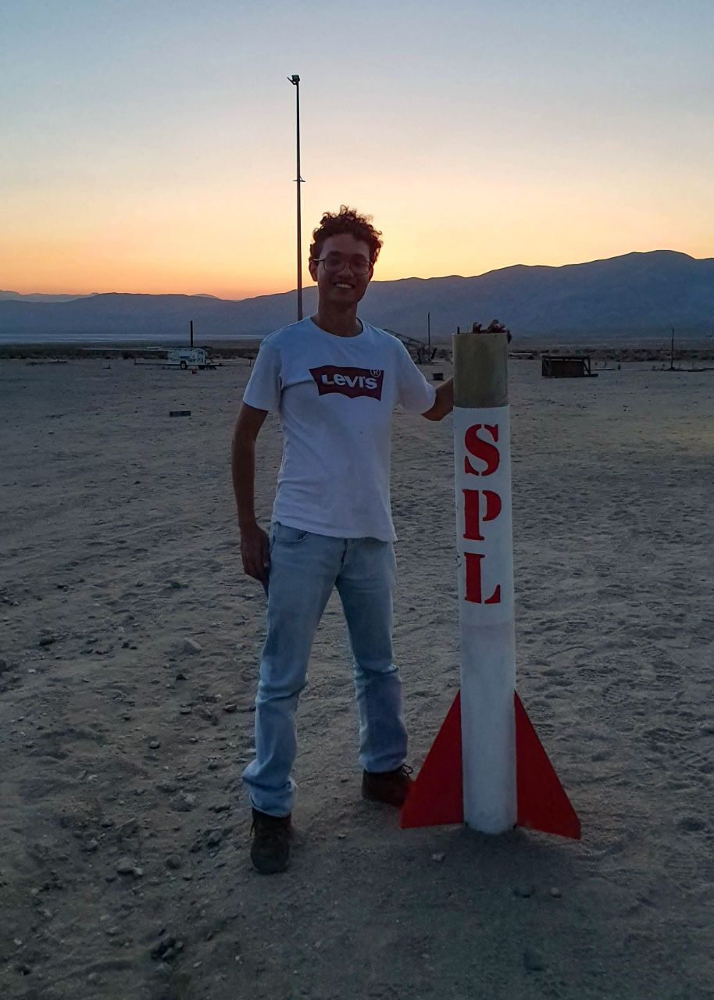

# About Us

We are a team based in the [School of Computing, National University of Singapore](http://www.comp.nus.edu.sg).

You can... not reach us at ~~email `seer[at]comp.nus.edu.sg`~~ the moment.

## Project Team

| Member | :camera:                                          | About Us | Roles | Responsibilities | Connect with us! |
|:--- |:--------------------------------------------------|:--- |:--- |:--- |:--- |
| Chua Zen Khoon |  | Y2 CS student. I do creative works such as writing and worldbuilding in my free time! | Project Planner | Deliverables and Deadlines, Scheduling and Tracking | [[github](http://github.com/ChuaZenKhoon)] |
| Lee Shun Jie |     | Y2 CS student. I like to travel and explore the world! | Developer | UI |  [[github](http://github.com/shunjieee)] |
| Oliver James Tan |      |
| Liu Jiayao |
| Shanyl Ong |     | Y2 CS student. I like reading and engaging in nature photography! | Developer | UI, Additional Functionalities | [[github](http://github.com/ShanylOng)] |
