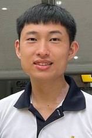

We are a team based in the [School of Computing, National University of Singapore](http://www.comp.nus.edu.sg).

You can reach us at the email `seer[at]comp.nus.edu.sg`

## Project team

### John Doe

[[homepage](http://www.comp.nus.edu.sg/~damithch)]
[[github](https://github.com/johndoe)]
[[portfolio](team/johndoe.md)]

* Role: Project Advisor

### Gavin Goh

[[github](http://github.com/gavin331)]
[[portfolio](team/gavingoh.md)]

* Role: Team Member
* Responsibilities: Deliver the project tasks on time and ensure the quality of the project.

### John Chan

[[github](http://github.com/azumieflare)] [[portfolio](team/azumieflare.md)]

* Role: Deliverables and deadlines
* Responsibilities: Ensuring project deliverables are done on time and in the right format.

### Bryan Lee

[[github](http://github.com/BryanL2303)]
[[portfolio](team/bryanlee.md)]

* Role: Scheduling and tracking
* Responsibilities: In charge of defining, assigning, and tracking project tasks
