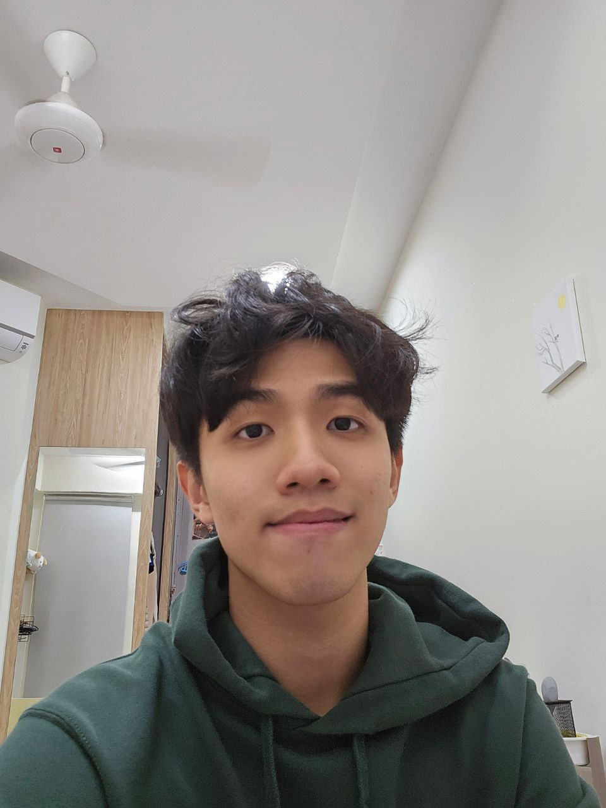
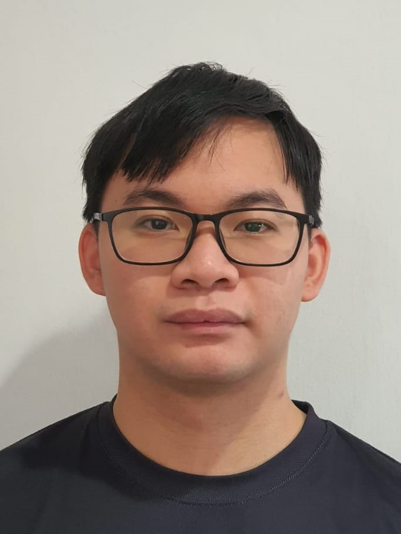
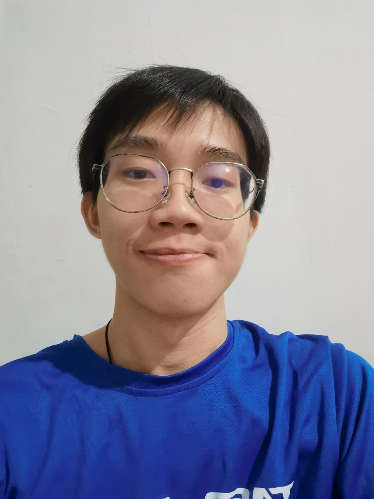
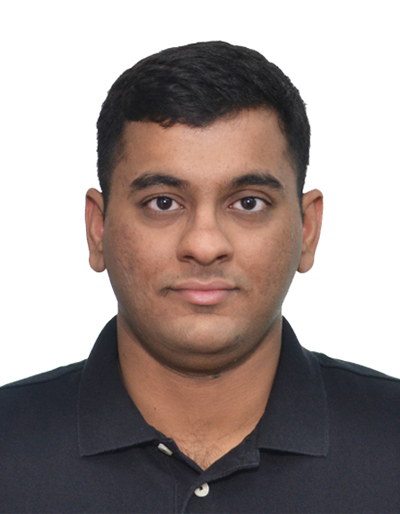

We are a team based in the [School of Computing, National University of Singapore](http://www.comp.nus.edu.sg).

You can reach us at the email `seer[at]comp.nus.edu.sg`

## Project team

### Ho Jin Han

[[github](http://github.com/jinhanfromNUS)]
[[portfolio](team/jinhanfromNUS.md)]

* Role: Developer
* Responsibilities: Features and Documentation

### Khoo Jing Xiang

[[github](http://github.com/meowwtama)]
[[portfolio](team/meowwtama.md)]

* Role: Developer
* Responsibilities: UI

### Ashley Chang

[[github](http://github.com/ashleyclx)] [[portfolio](team/ashleyclx.md)]

* Role: Developer
* Responsibilities: Features and Documentation

### Tan Yi-Sheng

[[github](http://github.com/Ty-stan0417)]
[[portfolio](team/Ty-stan0417.md)]

* Role: Developer
* Responsibilities: Features and Documentation

### Shenoy Suraj Bantwal

[[github](https://github.com/Darkarche3)]
[[portfolio](team/Darkarche3.md)]

* Role: Developer
* Responsibilities: Testing
