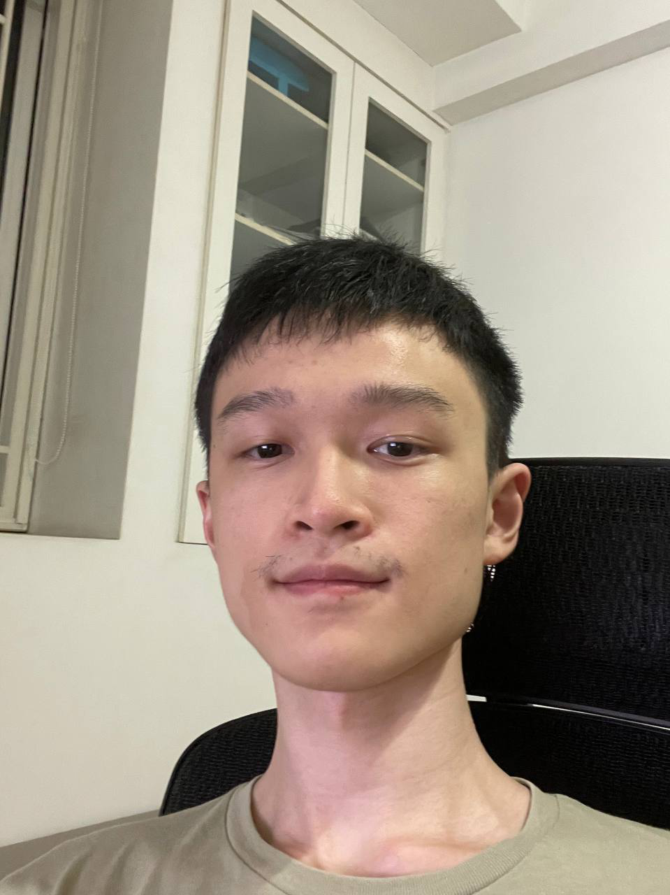

# About Us

We are a team based in the [School of Computing, National University of Singapore](http://www.comp.nus.edu.sg).

You can reach us at the email `seer[at]comp.nus.edu.sg`

## Project team

### Jay Hong

[[github](https://github.com/hjungwoo01)] [[portfolio](team/hjungwoo01.md)]

- Role: Developer
- Responsibilities: Team lead, Integration, Deliverables and deadlines

### Priyansh Bimbisariye

[[github](https://github.com/PyromancerBoom)] [[portfolio](team/pyromancerboom.md)]

- Role: Developer
- Responsibilities: Scheduling and Tracking, Deliverables and deadlines

### Shayaan Sultan

[[github](http://github.com/shayaansultan)] [[portfolio](team/shayaansultan.md)]

- Role: Developer
- Responsibilities: Documentation, Deliverables and deadlines

### Que Linxiao

[[github](http://github.com/quelinxiao)] [[portfolio](team/quelinxiao.md)]

- Role: Developer
- Responsibilities: Testing, Deliverables and deadlines
