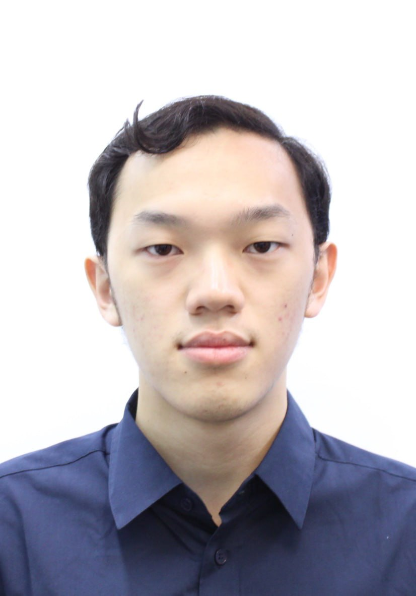
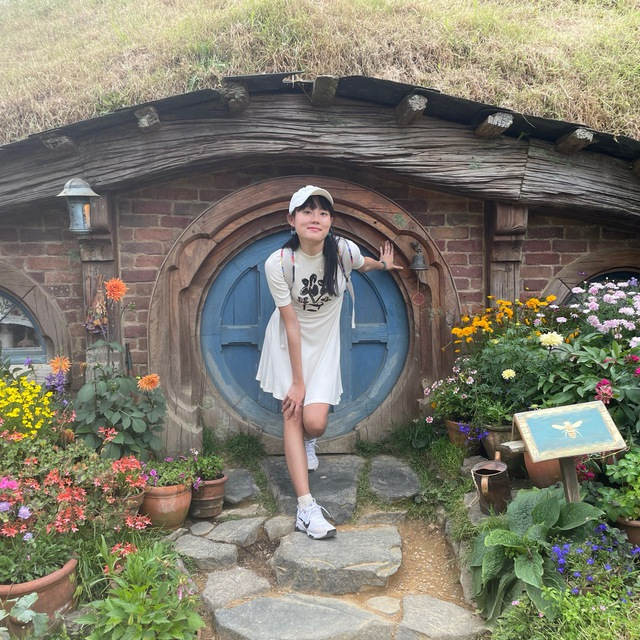
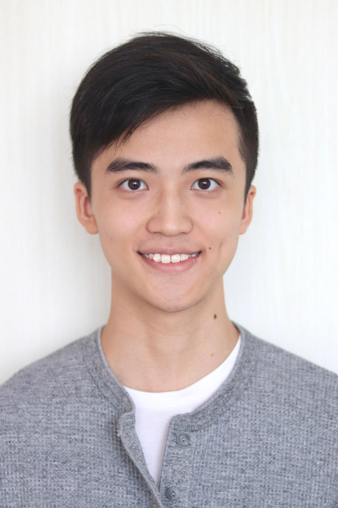
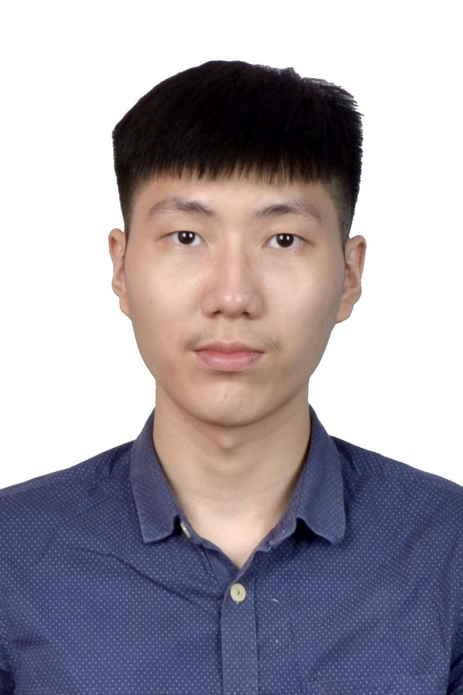
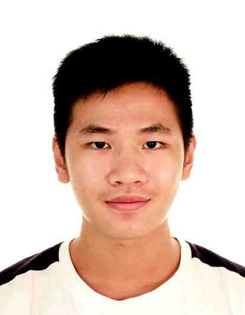

We are a team based in the [School of Computing, National University of Singapore](http://www.comp.nus.edu.sg).

You can reach us at the email `seer[at]comp.nus.edu.sg`

## Project team

### Ong Tze Jet

[[homepage](http://www.comp.nus.edu.sg/~damithch)]
[[github](https://github.com/iamtr)]
[[portfolio](team/johndoe.md)]

* Role: Project Advisor

### An Eu Jin

[[github](http://github.com/ejnan)]
[[portfolio](team/johndoe.md)]

* Role: Team Lead
* Responsibilities: UI

### Ryan Lim Ding Xuan

[[github](http://github.com/ryanlimdx)] [[portfolio](team/johndoe.md)]

* Role: Developer
* Responsibilities: Data

### Tan Shao Wei

[[github](http://github.com/swtan346)]
[[portfolio](team/johndoe.md)]

* Role: Developer
* Responsibilities: Dev Ops + Threading

### Ervin Teo Jun Xiong

[[github](http://github.com/erv-teo)]
[[portfolio](team/johndoe.md)]

* Role: Developer
* Responsibilities: UI
