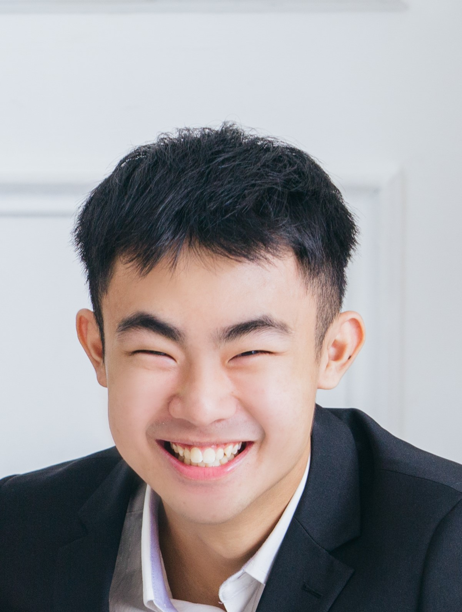
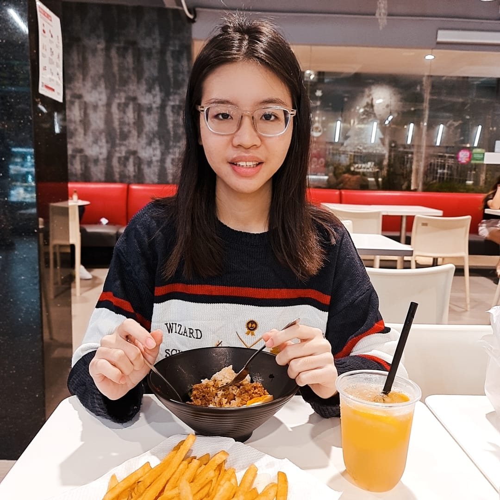
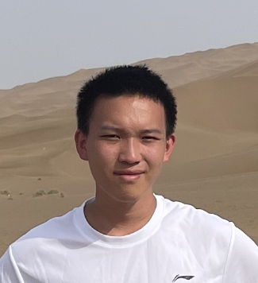

# About Us

We are a team based in the [School of Computing, National University of Singapore](http://www.comp.nus.edu.sg).

You can reach us at the email `seer[at]comp.nus.edu.sg`

## Project team

### Kumar Prabhat

[[github](http://github.com/dedsecrattle)]
[[portfolio](http://theprabhat.me)]

* Role: Developer
* Responsibilities: Backend, UI, DevOps

### Tan Jun Heng

[[github](http://github.com/Austintjh19)] [[portfolio](https://austintanjunheng.netlify.app/)]

* Role: Developer
* Responsibilities: Backend, UI, DevOps

### Lim Rui Ting Valencia

[[github](http://github.com/ValenciaLim)]
[[portfolio](https://valencialim.github.io/)]

* Role: Developer
* Responsibilities: Dev Ops + Threading

### Li Zizhen

[[github](https://github.com/Li-Zizhen)]
[[portfolio](team/johndoe.md)]

* Role: Developer
* Responsibilities: UI
