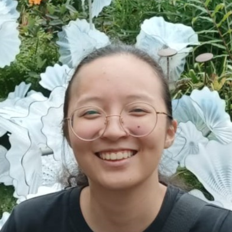
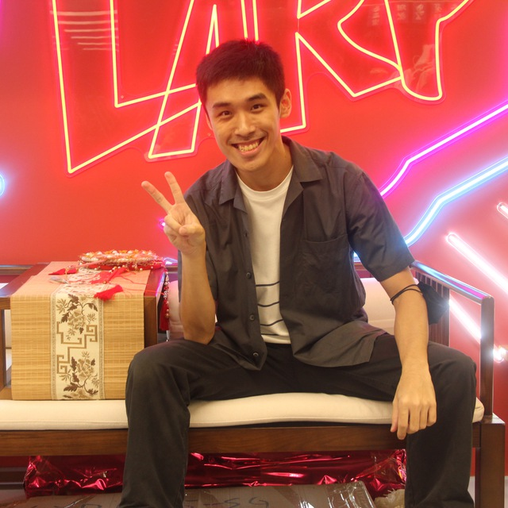
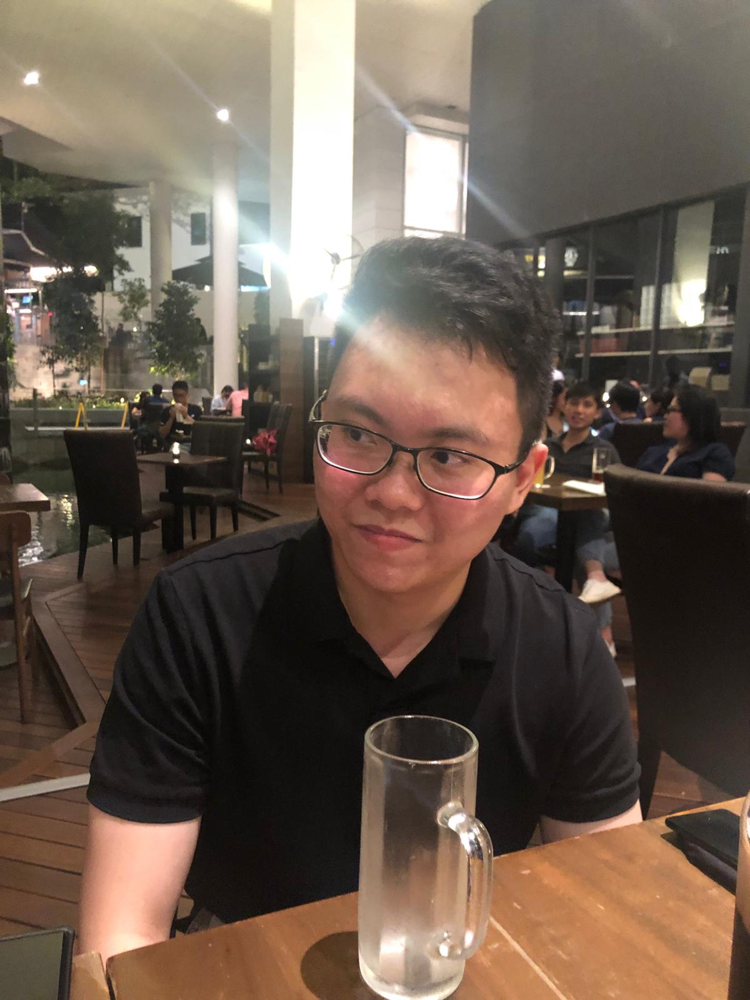

# About Us

We are a team based in the [School of Computing, National University of Singapore](http://www.comp.nus.edu.sg).

You can reach us at the email `seer[at]comp.nus.edu.sg`

## Project team

### Chia York Lim

[[github](http://github.com/yorklim)]
[[portfolio](team/yorklim.md)]

* Role: Team lead + Code quality
* Responsibilities: Dev Ops

### Ge Shuqing

[[github](http://github.com/getsquared)]
[[portfolio](team/shuqing.md)]

* Role: Integration + Documentation
* Responsibilities: UI

* Role: Project Advisor

### Regan Choy

[[github](http://github.com/ReganChoy)]
[[portfolio](team/reganchoy.md)]

* Role: Deliverables + Deadline + Scheduling
* Responsibilities: Model

### Solomon Ng

[[github](http://github.com/solomonng2001)]
[[portfolio](team/solomonng.md)]

* Role: Testing
* Responsibilities: Storage
