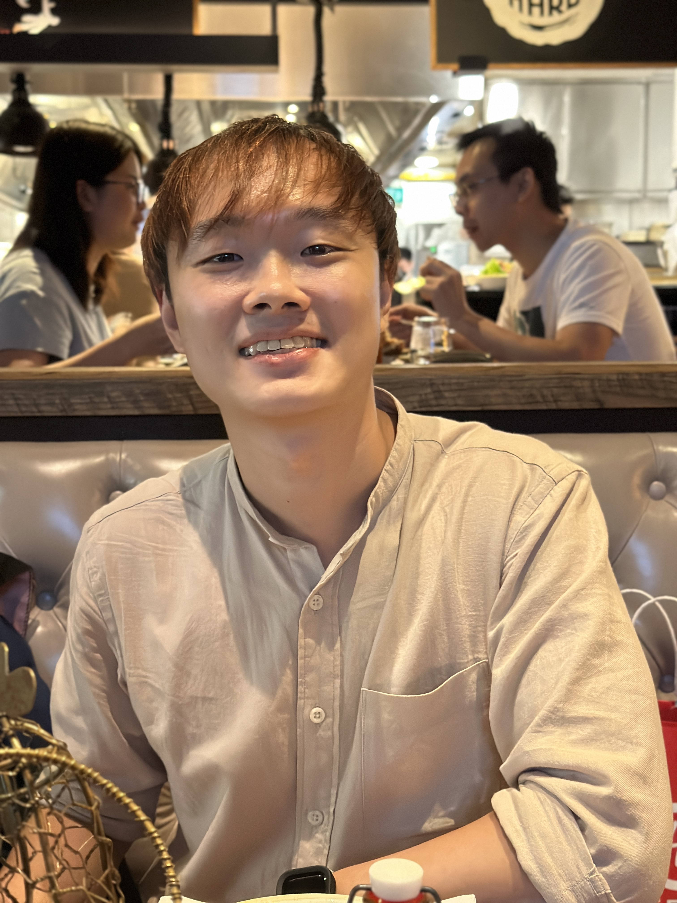
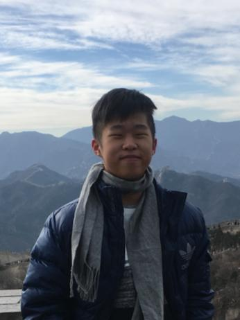

We are a team based in the [School of Computing, National University of Singapore](http://www.comp.nus.edu.sg).

You can reach us at the email `seer[at]comp.nus.edu.sg`

## Project team

### Lim Zhekai

[[github](https://github.com/zhekaiii)]
[[portfolio](team/zhekaiii.md)]

* Role: Developer
* Responsibilities: Code Reviews & Backend

### Alvin Ng

[[github](http://github.com/alvinnzz)]
[[portfolio](team/alvinnzz.md)]

* Role: Developer
* Responsibilities: Integration

### Johnny Doe

[[github](http://github.com/johndoe)] [[portfolio](team/johndoe.md)]

* Role: Developer
* Responsibilities: UI

### Jean Doe

[[github](http://github.com/johndoe)]
[[portfolio](team/johndoe.md)]

* Role: Developer
* Responsibilities: Dev Ops + Threading

