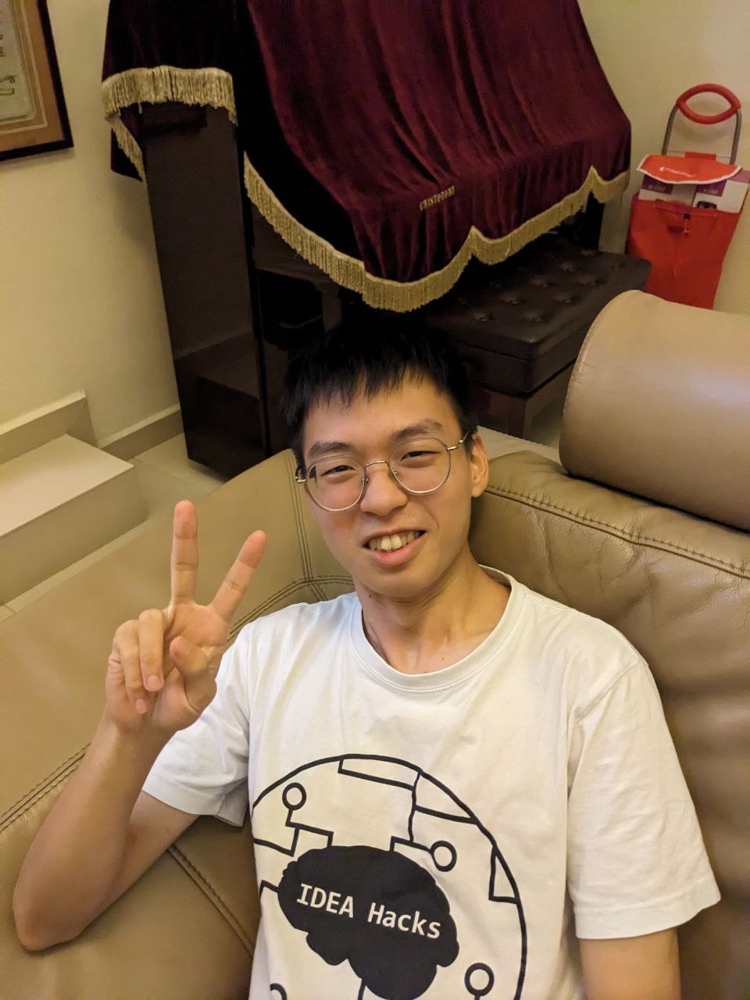
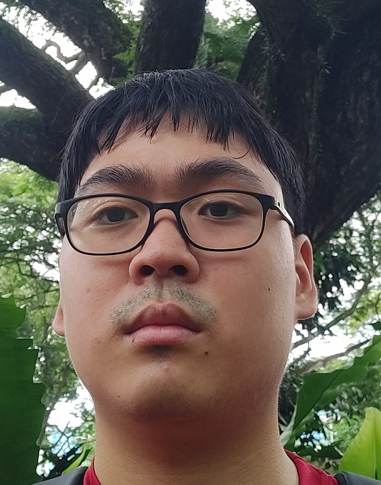
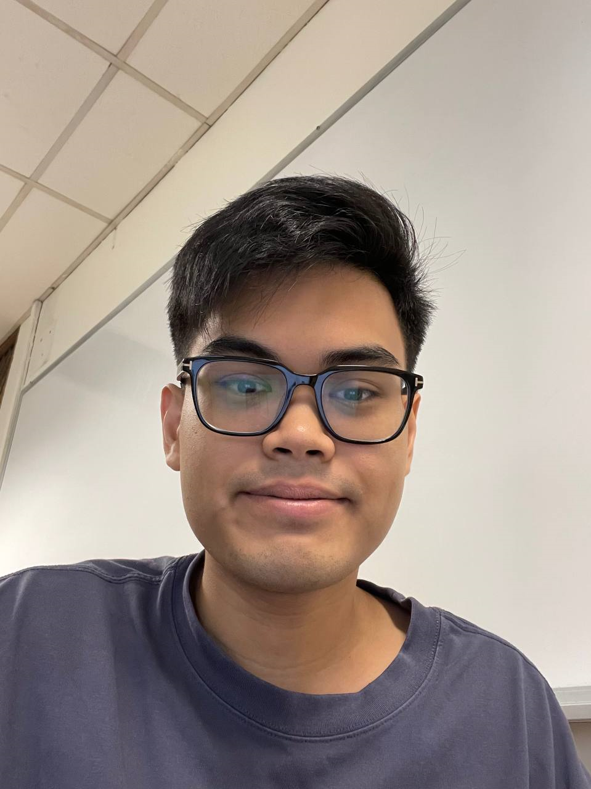
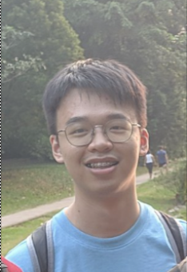

# About Us

We are a team based in the [School of Computing, National University of Singapore](http://www.comp.nus.edu.sg).

You can reach us at the email `seer[at]comp.nus.edu.sg`

## Project team

### Tang Yetong

[[homepage](https://darkvoid32.github.io/)]
[[github](https://github.com/darkvoid32)]
[[portfolio](team/darkvoid32.md)]

* Roles: UI & UX Expert
* Responsibilities: Designs and implements frontend for the application, and 
maintains user documentation.

### Leong Heng Yew

[[github](http://github.com/aureliony)]
[[portfolio](team/aureliony.md)]

* Roles: Git & Integration Expert
* Responsibilities: Defines and assigns technical project tasks. In charge of 
versioning, maintaining the code, and vets all changes to the code.

### Yee Jun Hyeok Bryan

[[github](http://github.com/bryanyee33)]
[[portfolio](team/bryanyee33.md)]

* Roles: Backend Expert
* Responsibilities: In charge of backend implementation and associated technical
documentation.

### Muhammad Rizki Bayuaji

[[github](http://github.com/rizkidelta)]
[[portfolio](team/rizkidelta.md)]

* Roles: UI & UX Expert
* Responsibilities: Designs and implements frontend for the application, and
maintains user documentation.

### Guk Yi Siong

[[github](http://github.com/yisiox)]
[[portfolio](team/yisiox.md)]

* Role: Taskmaster & QA Expert
* Responsibilities: In charge of overall coordination, tracking deadlines and 
deliverables, testing of code, and ensuring code and documentation quality.

